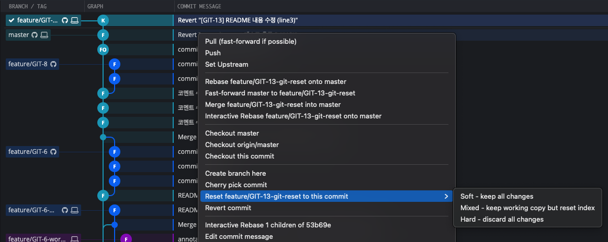
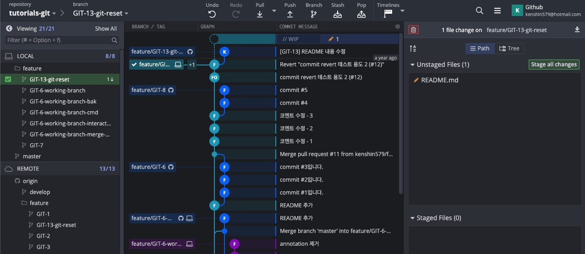

# 1.Git Reset

Git으로 작업하다 보면 커밋된 이력을 다시 되돌려야 할 때가 종종 발생한다. Git Reset에서는 아래와 같이 3가지 옵션을 제공한다. 각 옵션의 차이점에 대해서 알아보자. 

## 1.1 Git Reset 종류

- `soft`
  - 커밋만 되돌리고 싶을 때 사용한다
  - 변경한 코드는 stage area에 남겨지게 된다
- `mixed` (기본 옵션)
  - 변경한 인덱스(stage area)의 상태를 원래대로 되돌리고 싶을 때 사용한다
  - 변경한 코드는 작업 디렉토리에 남는다. 다시 커밋하려면 staged area에 다시 추가해야 한다
- `hard`
  - 최근의 커밋을 완전히 버리고 이전의 상태로 되돌리고 싶을 때 사용한다
  - 변경한 코드는 다 사라지기 때문에 hard 코드 사용시 주의가 필요하다

### 1.1.1 용어 정리

| 용어                 | 설명                           |
| -------------------- | ------------------------------ |
| HEAD                 | - 현재 브랜치를 가리킨다       |
| Index (Staging Area) | - 바로 커밋할 파일들이 있는 곳 |
| Working Directory    | - 수정할 파일들이 있는 곳      |


## 1.2 GitKraken에서 Git Reset 해보기

### 1.2.1 Reset 하는 방법

#### 1.2.1.1 Git 명령어로

Git Reset 명령어는 아래 형식으로 실행된다. 모드 옵션은 위 3가지 중에 하나이고 없는 경우 기본 값으로 `mixed` 모드로 동작한다. 리리셋할 커밋은 commit 번호나 HEAD~# 형식으로 지정할 수 있다. 

> HEAD 현재 커밋될 위치를 나타낸다. HEAD~2의 의미는 이전 2개 커밋을 의미한다. 

```bash
$ git reset --<모드> <commit>
```

여러 가지 Git Reset 명령어들이다. 

```bash
$ git reset HEAD~1 # 커밋한 바로 전으로 돌아간다
$ git reset c1c2239a #c1c2239a 커밋으로 되돌린다 (mixed 모드)
$ git reset --hard c1c2239a #c1c2239a 커밋으로 되돌린다 (hard 모드)
```


#### 1.2.1.2 GitKraken으로 

GitKraken에서는 commit 목록에서 리셋하려는 커밋에서 우 클릭하면 pop-up 메뉴가 뜬다. 여기서 **Reset ### to this commit** 메뉴에서 원하는 모드를 선택한다.




### 1.2.2 Reset 종류별 예제 모음

이제 GitKraken에서 어떻게 3가지 모드로 리셋을 할 수 있는 지 직접 해보자. 현재 GIT-13을 커밋하고 remote repository에 푸시를 한 상태이다. 이제 전 커밋으로 3가지 모드로 되돌려 보자. 


#### 1.2.2.1 Soft Reset

Soft Reset이다. 그전 브랜치를 가리키고 `README.md` 파일은 이미 `staged area`에 있어서 다시 커밋을 할 수 있다. 


```bash
$ git status
On branch feature/GIT-13-git-reset
Your branch is behind 'origin/feature/GIT-13-git-reset' by 1 commit, and can be fast-forwarded.
  (use "git pull" to update your local branch)

Changes to be committed:
  (use "git restore --staged <file>..." to unstage)
        modified:   README.md
```

#### 1.2.2.2 Mixed Reset (기본 모드)

Mixed Reset이다. 브랜치 위치는 전 커밋으로 위치가 되었고 그전에 커밋한 건 파일들은 `staged area`에서 제외되어 커밋하려면 `staged area`에 다시 추가해줘야 한다. 



`git status` 명령어로도 파일이 staged 되어 있지 않아 `git add`로 추가해야 한다고 설명해주고 있다. 

```bash
$ git status
On branch feature/GIT-13-git-reset
Your branch is behind 'origin/feature/GIT-13-git-reset' by 1 commit, and can be fast-forwarded.
  (use "git pull" to update your local branch)

Changes not staged for commit:
  (use "git add <file>..." to update what will be committed)
  (use "git restore <file>..." to discard changes in working directory)
        modified:   README.md

no changes added to commit (use "git add" and/or "git commit -a")

```

#### 1.2.2.3 Hard Reset

Hard Reset이다. 이전 커밋으로 되돌리면 그전 커밋은 그냥 사라지게 되어 사용시 주의가 필요하다. 


```bash
$ git status
On branch feature/GIT-13-git-reset
Your branch is behind 'origin/feature/GIT-13-git-reset' by 1 commit, and can be fast-forwarded.
  (use "git pull" to update your local branch)

nothing to commit, working tree clean
```


### 1.2.3 제목 변경해서 다시 commit하는 예제 (mixed 모드)

지금까지는 3가지 모드별로 어떤 차이점 있는지 알아보았다. 마지막 예제는 이미 원격으로 푸시된 커밋의 제목을 수정하는 예제로 마무리해보자. 

1.mixed 모드로 전 커밋으로 리셋시킨다. 다시 커밋할 파일을 staged area에 추가하고 커밋 제목을 다시 변경해서 커밋한다. 


2. 원격으로 강제 푸시를 한다. 


3. 변경된 제목으로 잘 푸시되었는지 확인하다. 


#2. 정리

Git Reset는 이제 마스터했으니 적절하게 사용하면 된다. 본 포스팅에서 작성한 코드는 [github](https://github.com/kenshin579/tutorials-git)에서 확인할 수 있다.

#3.  참고

- [https://www.devpools.kr/2017/02/05/%EC%B4%88%EB%B3%B4%EC%9A%A9-git-%EB%90%98%EB%8F%8C%EB%A6%AC%EA%B8%B0-reset-revert](https://www.devpools.kr/2017/02/05/초보용-git-되돌리기-reset-revert)/
- https://backlog.com/git-tutorial/kr/stepup/stepup6_3.html
- [https://git-scm.com/book/ko/v2/Git-%EB%8F%84%EA%B5%AC-Reset-%EB%AA%85%ED%99%95%ED%9E%88-%EC%95%8C%EA%B3%A0-%EA%B0%80%EA%B8%B0](https://git-scm.com/book/ko/v2/Git-도구-Reset-명확히-알고-가기)
- https://opentutorials.org/module/4032/24533
- https://c10106.tistory.com/3930
- https://antilog.tistory.com/33
- https://medium.com/@joongwon/git-git-%EC%9D%98-%EA%B8%B0%EC%B4%88-a7801f45091d
- https://c10106.tistory.com/3943

