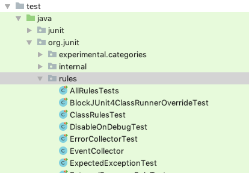
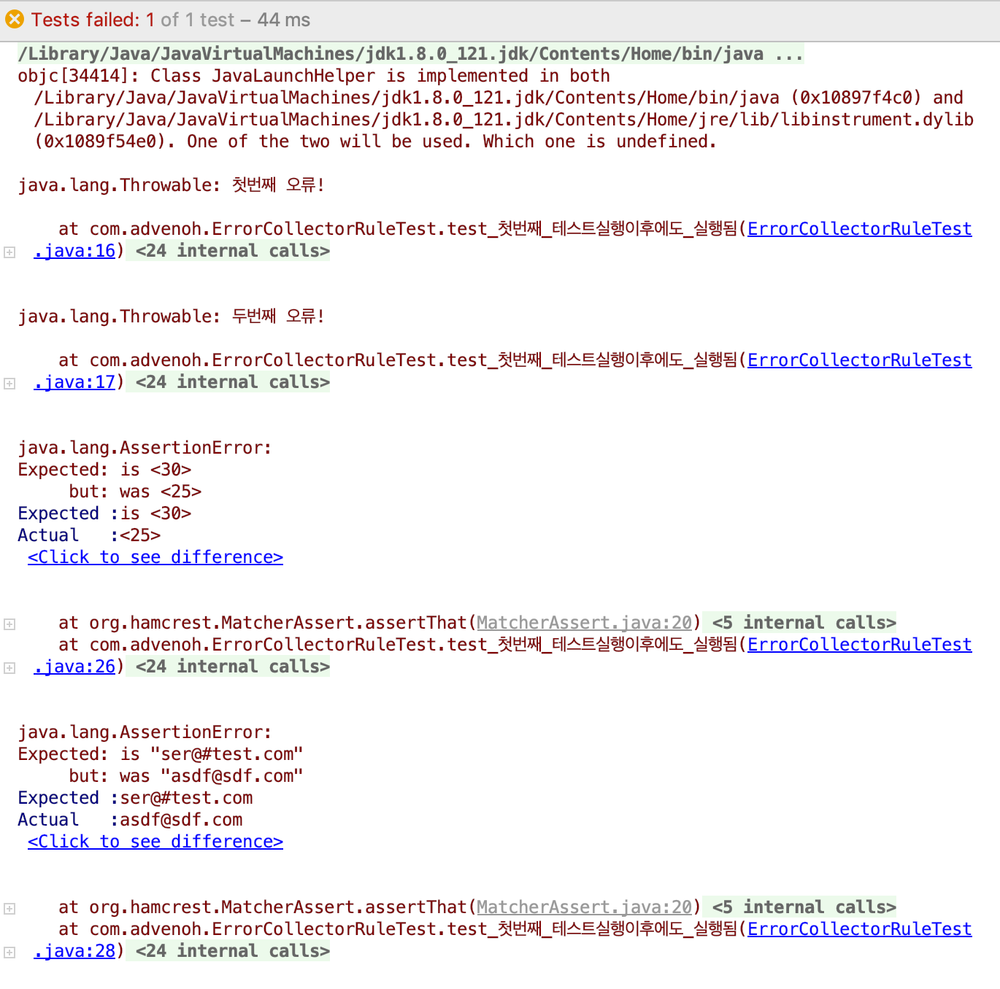
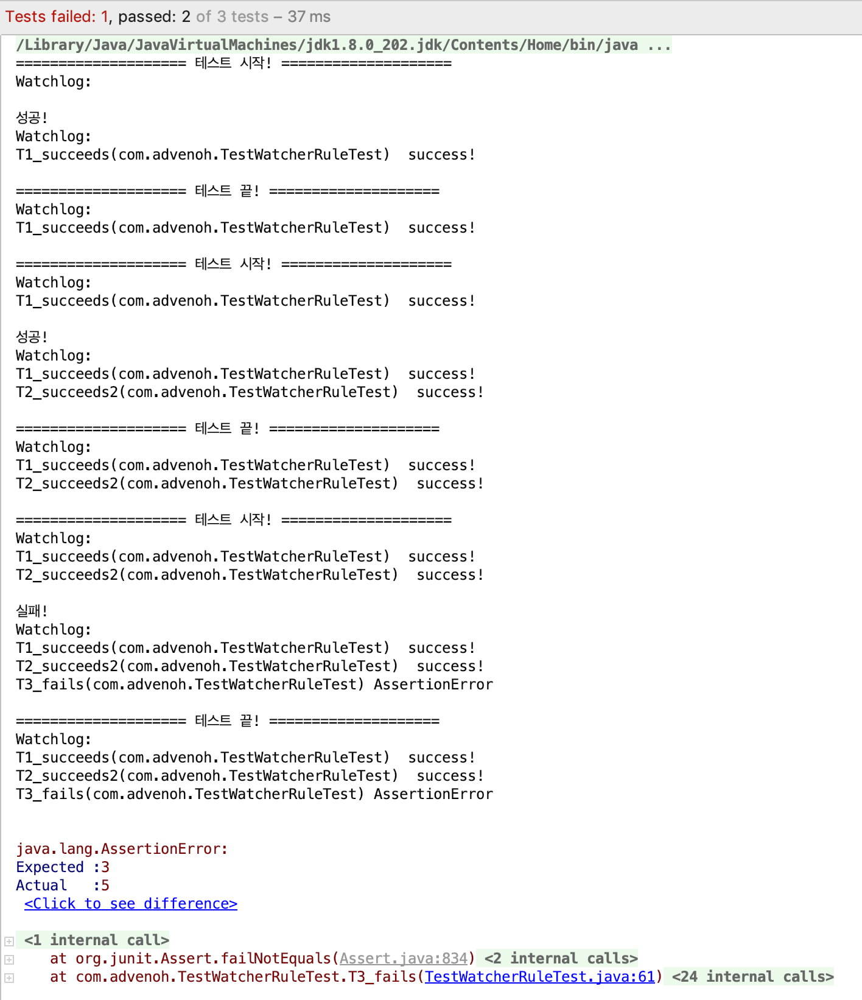

# 1. 들어가며

JUnit Rules은 테스트 케이스를 실행하기 전후에 추가 코드를 실행할 수 있도록 도와줍니다. @Before와 @After로 선언된 메서드에서도 실행 전후처리로 코드를 넣을 수 있지만, JUnitRules로 작성하면 재사용하거나 더 확장 가능한 기능으로 개발할 수 있는 장점이 있습니다. JUnit에서 기본적으로 제공하는 Rules은 다음과 같습니다.

| Rules             | 설명                                                         |
| ----------------- | ------------------------------------------------------------ |
| TemporaryFolder   | 테스트 전후로 임시 폴더 및 파일을 자동으로 생성하고 삭제한다 |
| ExternalResource  | 외부 리소스에 대한 전후처리를 한다                           |
| ExpectedException | 테스트 클래스 전체에 적용되며 예외 발생에 대해 직접 확인이 가능한다 |
| ErrorCollector    | 여러 테스트 실패시에도 연속적으로 테스트가 진행되며 발생한 오류를 수집한다 |
| Verifier          | 테스트 실행시 추가 검증을 하도록 도와준다.                   |
| TestName          | 실행하는 테스트 메서드 이름을 알려준다                       |
| RuleChain         | 여러 Rule을 체인형식으로 묶어 적용할 수 있도록 도와준다      |
| ClassRule         | 테스트 클래스 슈트 전체에 적용할 수 있는 Rule이다            |
| Timeout           | 테스트 클래스 전체 테스트에 timeout을 설정한다               |

기본으로 제공하는 Rule 외에 직접 나만의 Rule은 어떻게 생성하는지도 같이 알아보겠습니다.

# 2. 개발 환경

- OS : Mac OS
- IDE: Intellij
- Java : JDK 1.8
- Source code : [github](https://github.com/kenshin579/tutorials-java/tree/master/junit-rule)
- Software management tool : Maven

포스팅을 위해 여러 예제를 작성하였지만, 다양한 사용법을 더 보고 싶으면, JUnit4소스코드에 포함된 테스트 케이스들을 보면 더 다양하게 사용되는 예제를 확인할 수 있습니다.



메이븐 의존성으로 pom.xml 파일에 JUnit을 추가합니다.

```xml
<dependency>
  <groupId>junit</groupId>
  <artifactId>junit</artifactId>
  <version>4.12</version>
  <scope>test</scope>
</dependency>
```

# 3. JUnit Rules

## 3.1 기본으로 제공하는 Rules

JUnit Rules에서 대표적으로 많이 사용되는 예제들을 보겠습니다.

### 3.1.1 TemporaryFolder

TemporayFolder Rule은 테스트 실행 시 파일이나 폴더를 자동으로 생성하고 테스트 종료 시에도 자동으로 삭제해주는 Rule입니다. 임의 파일을 생성하게 되면 맥에서는 아래와 같은 폴더에 생성됩니다.

```bash
/var/folders/f3/z3w0kdln2sn_7z0_qq6rn4dxrgwgh2/T/junit88560316993858696/test.txt
```

```java
public class TemporaryRuleTest {
   @Rule
   public TemporaryFolder tmpFolder = new TemporaryFolder();

   @Test
   public void test_임시파일_생성하기() throws IOException {
      File tmpFile = tmpFolder.newFile("test.txt");
      assertThat(tmpFile.isFile()).isTrue();
      assertThat(tmpFolder.getRoot()).isEqualTo(tmpFile.getParentFile());
   }

   @Test
   public void test_임시_폴더_생성하기() throws IOException {
      File tmpFile = tmpFolder.newFolder();
      assertThat(tmpFile.isDirectory()).isTrue();
   }
}
```

### 3.1.2 ExpectedException

ExpectedException Rule은 @Test(expected = RunTimeException.class) 대신 사용할 수 있고 예외 타입과 예외 메시지도 직접 확인이 가능하게 해주는 Rule입니다.

```java
public class ExpectedExceptionRuleTest {
   @Rule
   public ExpectedException exception = ExpectedException.none();

   @Test
   public void IllegalArgumentException_예외_발생_확인() {
      exception.expect(IllegalArgumentException.class);
      throw new IllegalArgumentException();
   }

   @Test
   public void RuntimeException_예외_발생시_메시지도_같이_확인() {
      exception.expect(RuntimeException.class);
      exception.expectMessage("failed!");
      throw new RuntimeException("failed!");
   }
}
```

### 3.1.3 Timeout

Timeout Rule은 모든 테스트에 대해 같은 timeout 설정을 할 수 있게 하는 Rule입니다.

```java
public class TimeoutRuleTest {
   @Rule
   public Timeout timeout = Timeout
         .builder()
         .withTimeout(2, TimeUnit.SECONDS)
         .build();

   @Test
   public void test1() {
      while (true) {
      }
   }

   @Test
   public void test2() {
      while (true) {
      }
   }
}
```

**테스트 결과**

Timeout 설정을 2초로 해서 2초이상 실행되면 TimeOutException을 발생시킵니다.


### 3.1.4 ErrorCollector

ErrorCollector Rule은 assertion이 실패하더라도 테스트를 계속 실행하여 전체 오류를 수집하는 기능입니다. 테스트 실행 시 발생하는 장애(ex. 네트워크)가 있더라도 테스트를 계속 진행하고 싶을 때 이 Rule을 사용하면 좋습니다.

ErrorCollector 사용시 아래 2가지 메서드를 사용하면 됩니다.

- addError() : 예외가 발생했을 때 해당 예외와 메시지를 같이 출력하도록 오류를 추가해준다
- checkThat() : 기대 값과 실제 값이 같은지 체크하고 값이 다르더라도 테스트는 계속 진행한다

```java
public class ErrorCollectorRuleTest {
   @Rule
   public ErrorCollector collector = new ErrorCollector();

   @Test
   public void test_첫번째_테스트실행이후에도_실행됨() {
      collector.addError(new Throwable("첫번째 오류!"));
      collector.addError(new Throwable("두번째 오류!"));

      Person person = Person
            .builder()
            .name("Frank")
            .email("asdf@sdf.com")
            .age(25)
            .build();

      collector.checkThat(person.getAge(), is(30)); //실패1
      collector.checkThat(person.getName(), is("Frank")); //성공
      collector.checkThat(person.getEmail(), is("ser@#test.com")); //실패2
   }
}
```

**테스트 결과**

기대 값과 실제 값이 다르면 addError()로 추가된 메시지를 출력만 하고 일단 테스트를 계속 실행합니다. 테스트 실행이후에 각 실패에 대한 결과를 출력합니다.



### 3.1.5 Verifier

Verifier Rule은 테스트 실행할 때마다 실행되며 사용자 정의 검증 로직을 추가로 넣어 특정 조건을 만족하는지 검증하는 데 사용됩니다.

```java
public class VerifierRuleTest {
   int MAX_AGE = 25;
   List<Person> peopleWithAgeGreaterThanMaxAge = new ArrayList<>();

   @Rule
   public Verifier verifier = new Verifier() {
      @Override public void verify() {
         assertThat(peopleWithAgeGreaterThanMaxAge.size()).as("나이 %d가 넘는 사람: %s", MAX_AGE, peopleWithAgeGreaterThanMaxAge).isEqualTo(0);
      }
   };

   @Test
   public void personTest1() {
      Person person = Person.builder()
            .name("Frank")
            .age(20)
            .build();
      if (person.getAge() > MAX_AGE) {
         peopleWithAgeGreaterThanMaxAge.add(person);
      }
   }

   @Test
   public void personTest2() {
      Person person = Person.builder()
            .name("Angela")
            .age(30)
            .build();
      if (person.getAge() > MAX_AGE) {
         peopleWithAgeGreaterThanMaxAge.add(person);
      }
   }
}
```

**테스트 결과**

모든 테스트 실행 시 추가로 사람의 나이가 25 이상 인지를 검증합니다. 두 번째 테스트 personTest2에서 나이가 30이라서 실패로 떨어졌습니다.


### 3.1.6 TestName

TestName Rule은 현재 실행되는 메서드 이름을 불러오도록 해줍니다.

```java
public class TestNameRuleTest {
   @Rule
   public TestName name = new TestName();

   @Test
   public void 테스트1_이름입니다() {
      assertEquals("테스트1_이름입니다", name.getMethodName());
   }

   @Test
   public void 테스트2_이름입니다() {
      assertEquals("테스트2_이름입니다", name.getMethodName());
   }
}
```

### 3.1.7 RuleChain

RuleChain Rule은 테스트 실행 시 여러 Rule을 순차적으로 실행하도록 도와주는 Rule입니다.

예제에서는 사용자 정의로 생성한 LoggingRule을 체인형식으로 적용하였습니다. LoggingRule은 각 테스트 전후로 시작… 끝…. 로그 메시지를 출력하는 Rule로 이해하시면 되고 더 자세한 내용은 #3.2에서 다루도록 하겠습니다.

```java
public class RuleChainTest {
   @Rule
   public TestRule chain = RuleChain
         .outerRule(new LoggingRule("outer rule"))
         .around(new LoggingRule("middle rule"))
         .around(new LoggingRule("inner rule"));

   @Test
   public void test() {
   }
}
```

**테스트 결과**


### 3.1.8 ExternalResource

ExternalResource Rule은 테스트 전에 외부 리소스(ex. 파일, 네트워크 소켓, 서버, 데이터베이스 연결 등)에 접근할 수 있도록 자원에 연결해주고 테스트 종료 후에도 연결을 자동으로 끊어주는 Rule입니다.

```java
@Slf4j
public class ExternalResourceRuleTest {
   public static Server server =  new Server();

   @Rule
   public final ExternalResource externalResource = new ExternalResource() {
      @Override protected void before() throws Throwable {
         server.connect();
      }
      @Override protected void after() {
         server.disconnect();
      }
   };

   @Test
   public void 서버테스트() throws Exception {
      log.info("Start 서버 테스트");
   }
}

@Slf4j
public class Server {
   public void connect() {
      log.info("connect...");
   }

   public void disconnect() {
      log.info("disconnect...");
   }
}

```

**테스트 결과**

테스트 실행 전후로 서버에 연결하고 종료 후에는 연결을 끊고 있습니다.


### 3.1.9 ClassRule

ClassRule 어노테이션을 @Rule 어노테이션과 같이 사용하면 TestSuite로 묶여 있는 클래스를 통합하여 실행해줍니다.

```java
@RunWith(Suite.class)
@Suite.SuiteClasses({ TestFirstServer.class, TestSecondServer.class, TestThirdServer.class })
@Slf4j
public class ExternalResourceClassRuleTest {
   public static Server server = new Server();

   @ClassRule
   @Rule
   public static final ExternalResource externalResource = new ExternalResource() {
      @Override protected void before() throws Throwable {
         server.connect();
      }
      @Override protected void after() {
         server.disconnect();
      }
   };
}

@Slf4j
public class TestFirstServer {
   @Test
   public void test() throws Exception {
      log.info("{}", this.getClass().getSimpleName());
   }
}
```

**테스트 결과**

여러 테스트 클래스가 시작하기 전에 서버 연결을 먼저하고 모든 테스트가 끝나고 나서 서버 연결을 끊는 것을 확인할 수 있습니다.


### 3.1.10 TestWatcher

TestWatcher Rule은 테스트 실행에 대한 성공 실패를 모니터링 하는 기능을 제공하여 테스트 로그를 쓰도록 도와줍니다.

```java
@FixMethodOrder(MethodSorters.NAME_ASCENDING)
public class TestWatcherRuleTest {
   private static String watchedLog = "\n”;

   @Rule
   public TestRule watchman = new TestWatcher() {
      @Override
      public Statement apply(Statement base, Description description) {
         return super.apply(base, description);
      }

      @Override
      protected void succeeded(Description description) {
         watchedLog += description.getDisplayName() + " success!\n";
         System.out.println(String.format("성공!\nWatchlog: %s", watchedLog));
      }

      @Override
      protected void failed(Throwable e, Description description) {
         watchedLog += description.getDisplayName() + " " + e.getClass().getSimpleName() + "\n";
         System.out.println(String.format("실패!\nWatchlog: %s", watchedLog));
      }

      @Override
      protected void starting(Description description) {
         super.starting(description);
         System.out.println(String.format("==================== 테스트 시작! ==================== \nWatchlog: %s", watchedLog));
      }

      @Override
      protected void finished(Description description) {
         super.finished(description);
         System.out.println(String.format("==================== 테스트 끝! ==================== \nWatchlog: %s", watchedLog));
      }
   };

   @Test
   public void T1_succeeds() {
      Assert.assertEquals(5, 5);
   }

   @Test
   public void T2_succeeds2() {
      Assert.assertEquals(2, 2);
   }

   @Test
   public void T3_fails() {
      Assert.assertEquals(3, 5);
   }
}
```

@FixMethodOrder는 테스트 실행 순서를 결정해주는 어노테이션으로 이 예제에서는 NAME_ASCENDING으로설정되어 메서드 이름의 순서대로 실행됩니다. TestWatcher에 정의된 starting(), finished(), succeeded(), failed() 메서드을 오버라이트하면 메서드 이름에 맞게 테스트 시작, 끝, 성공, 실패에 따라서 메서드들이 호출됩니다. 이 예제에서는 매번 실행할 때마다 watchedLog 스트링값에 로그형식으로 저장하여 화면에 출력합니다.

**테스트 결과**

메서드 이름의 순서대로 테스트가 실행되며 하나씩 실행할 때마다 로그가 쌓이고 있습니다.



## 3.2 Custom Rules

지금까지 JUnit에서 기본으로 제공하는 Rules을 알아보았습니다. 직접 Rule을 어떻게 생성하는지는 지금까지 소개해 드렸던 코드를 보면 더 이해가 쉽습니다. 예로. TemporaryFolder Rule을 살펴보도록 하겠습니다.

```java
public class TemporaryFolder extends ExternalResource {
    private final File parentFolder;
    private File folder;
    public TemporaryFolder() {
        this(null);
    }

    public TemporaryFolder(File parentFolder) {
        this.parentFolder = parentFolder;
    }

    @Override
    protected void before() throws Throwable {
        create();
    }

    @Override
    protected void after() {
        delete();
    }
…(생략)...
}
```

TemporaryFolder 클래스는 ExternalResource 클래스를 상속받아 before()와 after() 메서드를 구현하였습니다. 테스트 실행 전에 before() 메서드가 실행되며 create() 메서드를 호출합니다.

```java
public void create() throws IOException {
    folder = createTemporaryFolderIn(parentFolder);
}

private File createTemporaryFolderIn(File parentFolder) throws IOException {
    File createdFolder = File.createTempFile("junit", "", parentFolder);
    createdFolder.delete();
    createdFolder.mkdir();
    return createdFolder;
}
```

createTemporaryFolderIn() 메서드에서 알 수 있듯이 임의의 폴더를 만들어 File 클래스를 반환합니다. 테스트 이후에는 after() 메서드가 실행되며 create()에서 생성한 폴더를 삭제합니다.

```java
public abstract class ExternalResource implements TestRule {
    public Statement apply(Statement base, Description description) {
        return statement(base);
    }

    private Statement statement(final Statement base) {
        return new Statement() {
            @Override
            public void evaluate() throws Throwable {
                before();
                try {
                    base.evaluate();
                } finally {
                    after();
                }
            }
        };
    }

    protected void before() throws Throwable {
    }
    protected void after() {
    }
}

```

ExternalResource 클래스는 앞 써 봤던 before()와 after() 메서드를 가지고 기본적인 전후처리 알고리즘을 담고 있습니다. apply() 메서드가 호출되며 전후처리 로직이 실행되는 구조입니다. 실제로 apply() 메서드가 언제 호출되는지는 JUnit4소스 코드로 확인해보시면 좋을 듯합니다.

TemporaryFolder 클래스와 거의 유사한 코드이기는 하지만, 테스트 실행 전후로 ‘시작, 끝’을 출력하는 Rule을 만들어보겠습니다.

```java
public class LoggingRule implements TestRule {
   private String name;

   public LoggingRule(String name) {
      this.name = name;
   }
   public Statement apply(final Statement base, Description description) {
      return new Statement() {
         @Override
         public void evaluate() throws Throwable {
            try {
               System.out.println("시작: " + name);
               base.evaluate();
            } finally {
               System.out.println("끝: " + name);
            }
         }
      };
   }
}
```

base.evaluate()은 테스트가 실행되는 시점이고 전후로 생성자로 넘겨준 name과 같이 로그를 출력하는 코드를 추가하였습니다.

```java
public class CustomRuleTest {
   @Rule
   public LoggingRule rule = new LoggingRule("custom rule”);

   @Test
   public void test() {
      System.out.println("test 실행");
   }
}

```

**테스트 결과**


# 4. 결론

JUnit에 Rule이라는 여러 기능을 있는지는 이번 스터디 기회를 통해서 알게 되었습니다. 프로젝트를 하면서 테스트 코드를 많이 작성하는 편인데, JUnit Rule을 통해서 더 유용하게 적용할 수 있는 부분들이 있을 듯합니다. 이만 오늘 포스팅을 마무리하겠습니다.

# 5. 참고

- JUnit Rules
  - [https://github.com/junit-team/junit4/wiki/rules](https://github.com/junit-team/junit4/wiki/rules)
  - [https://www.swtestacademy.com/junit-rules/](https://www.swtestacademy.com/junit-rules/)
  - [https://www.alexecollins.com/tutorial-junit-rule/](https://www.alexecollins.com/tutorial-junit-rule/)
  - [https://stefanbirkner.github.io/system-rules/](https://stefanbirkner.github.io/system-rules/) \* [http://kwonnam.pe.kr/wiki/java/junit/rule](http://kwonnam.pe.kr/wiki/java/junit/rule)

