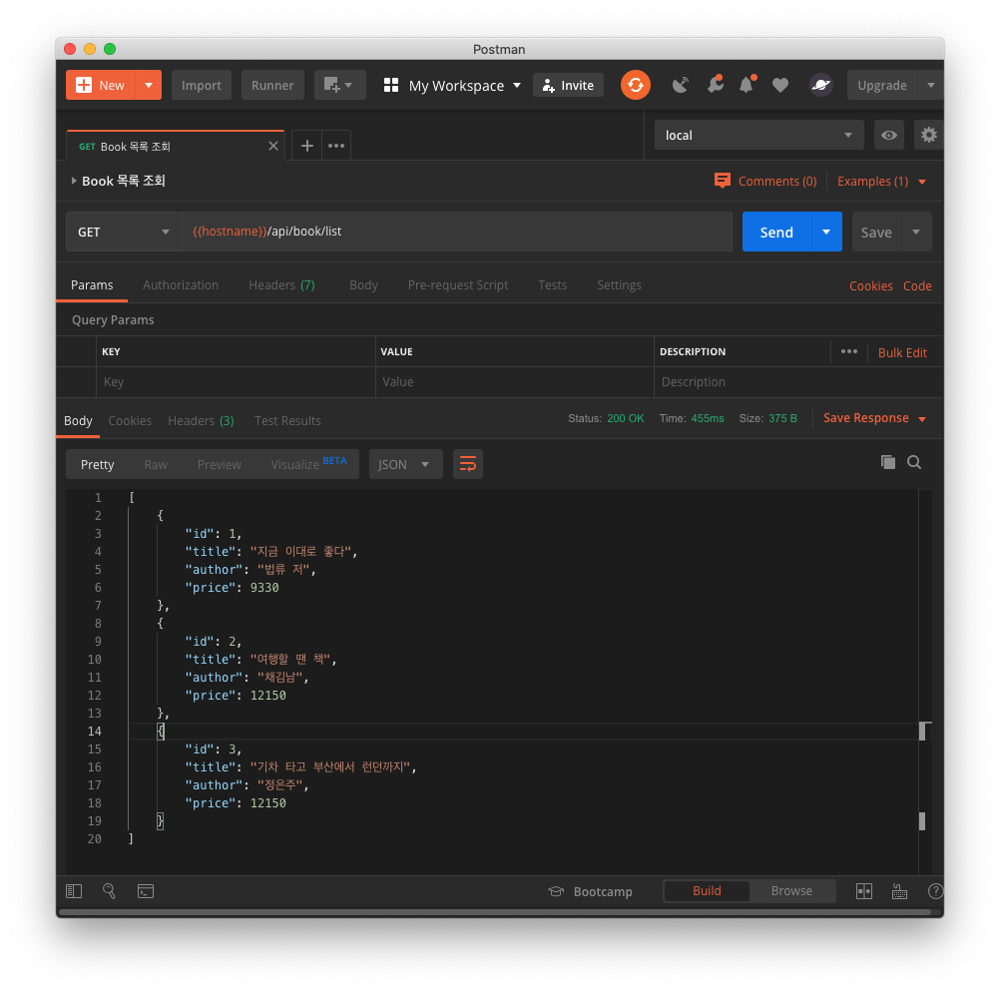
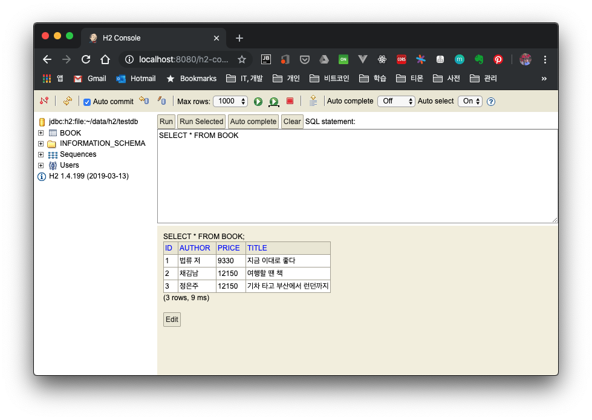
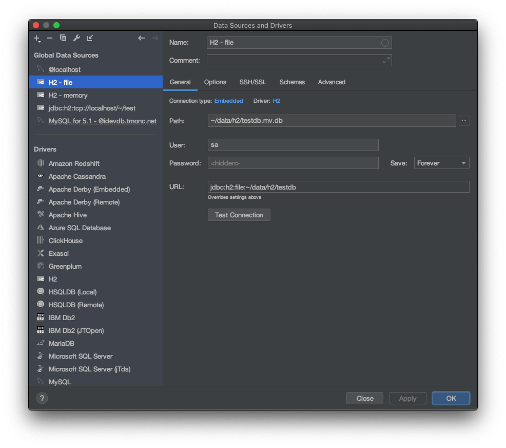
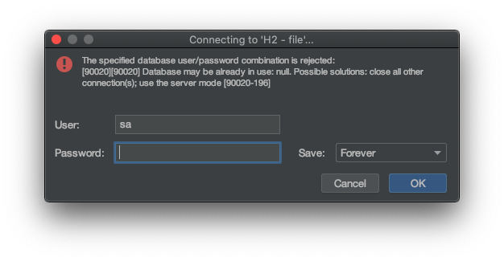
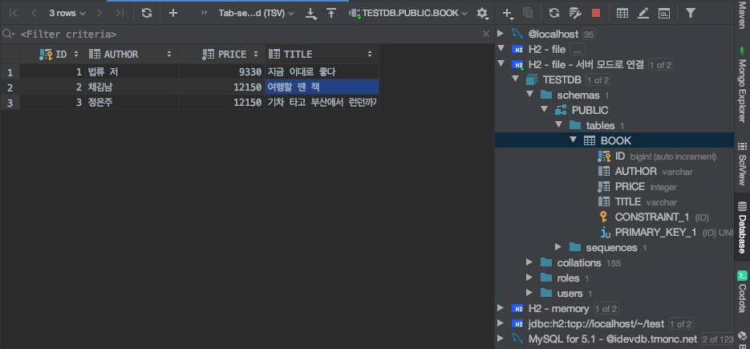

# 1. 들어가며

H2는 자바로 구현된 오픈소스 데이터베이스입니다. 인 메모리와 파일 기반의 데이터베이스 설정이 가능합니다. 자바 애플리케이션에 임베디드해서 사용하거나 서버 모드로 구동할 수 있습니다. 별도의 설치과정 없이 임베디드로 바로 사용할 수 있는 장점으로 많이 사용되는 DB입니다. 

이 포스팅에서는 H2에서 제공하는 여러 모드 외에도 웹 콘솔과 Intellij에서 H2에 연동하는 방법도 같이 알아보겠습니다. 

- 임베디드 모드
  - 메모리
  - 파일
- 서버 모드 - 여러 도구에서 같은 DB에 접속이 가능하다

# 2. 개발 환경

작업시 사용한 개발 환경과 소스코드입니다. 

* OS : Mac OS
* IDE: Intellij
* Java : JDK 1.8
* Source code : [github](https://github.com/kenshin579/tutorials-java/tree/master/springboot-data-jpa-h2)
* Software management tool : Maven


# 3. Spring Boot에서 H2 DB 사용해보기

## 3.1 JPA 샘플 코드 작성

스프링 부트와 H2 DB간의 연동를 위해 pom.xml 파일에 H2 라이브러리를 추가해야 합니다. 

```xml
<dependency>
  <groupId>com.h2database</groupId>
  <artifactId>h2</artifactId>
</dependency>
```

H2의 여러 환경 테스트를 위해서 간단한 JPA 샘플 코드를 작성해두겠습니다. JPA에서 제공하는 DDL 자동 생성 옵션(jpa.hiberate.ddl-auto)과 초기 데이터 로딩이 되도록 세팅하면 H2에 대한 세팅을 쉽게 확인할 수 있어서 관련 코드와 설정을 먼저하겠습니다. 

간단하게 JPA에서 사용할 Book 엔티티를 생성합니다.

```java
@Getter
@Setter
@Entity
@NoArgsConstructor
@Table(name = "book")
public class Book {
    @Id
    @GeneratedValue(strategy = GenerationType.IDENTITY)
    private Long id;

    private String title;

    private String author;

    private int price;
}
```

초기 데이터가 DB에 삽입되도록 src/main/resources/data.sql 파일을 생성해 둡니다. 서버 구동시 data.sql 스크립트가 실행 되면서 데이터가 로딩됩니다. 

```sql
INSERT INTO book (`title`, `author`, `price`) VALUES ('지금 이대로 좋다', '법류 저', 9330);
INSERT INTO book (`title`, `author`, `price`) VALUES ('여행할 땐 책', '채김남', 12150);
INSERT INTO book (`title`, `author`, `price`) VALUES ('기차 타고 부산에서 런던까지', '정은주', 12150);
```

API로도 호출해보기 위해서 BookController과 BookRepository 파일도 같이 생성했습니다. 두 파일은 github에 올라간 소스코드를 확인해주세요. 

## 3.2 H2 데이터베이스 설정

### 3.2.1 In-Memory

datasource 값은 다른 DB 설정할 때와 유사합니다.   

- spring.datasource.url
    - Connection URL - 참고 : [Database URL](https://www.h2database.com/html/features.html)
      - H2에서는 다양한 url 형식을 지원하여 여러 모드와 세팅을 할 수 있다
    - 예제. 
      - 엠비디드 연결 : ```jdbc:h2:[file:][<path>][databaseName]``` 
      - 인 메모리 : ```jdbc:h2:mem:<databaseName>``` 
      - 서버 모드 : ```jdbc:h2:tcp://<server>[:<port>]/[<path>]<databaseName>```
  - 추가 옵션 - 옵션에 대한 자세한 사항은  [H2 홈페이지](https://www.h2database.com/html/features.html)를 참고해주세요
    - MODE
  
      - H2에서는 다른 여러 DB처럼 동작 가능하도록 호환모드를 지원한다. 완벽하게 모든 기능을 지원하지는 않는다
       - ex. MODE=mysql (ex. CREATE TABLE 구문에서 INDEX()와 KEY()를 사용할 수 있게 됨)
  

```yml
# Database Settings
spring:
  datasource:
    url: jdbc:h2:mem:testdb;MODE=mysql;
    platform: h2
    username: sa
    password:
    driverClassName: org.h2.Driver
```

인 메모리는 메모리에만 데이터가 저장되기 때문에 애플리케이션 구동 시에만 존재합니다. 

### 3.2.2 File로 설정

DataSource 을 파일로 설정하면 애플리케이션이 종료되어도 데이터를 계속 남아 있습니다. Connection URL 형식은 파일 형식으로 작성하면 파일로 저장됩니다. 

```yml
# Database Settings
spring:
  datasource:
    url: jdbc:h2:file:~/data/h2/testdb;MODE=MySQL
    platform: h2
    username: sa
    password:
    driverClassName: org.h2.Driver
```

## 3.3 스프링 부트 구동해서 API 호출해보기

이제 스프링 부트를 구동해보고 각 설정에 따라 이상이 없는지 체크해보겠습니다. 

Postman을 사용해서 http://localhost:8080/api/book/list API를 호출하면 DB에 추가된 데이터를 응답 값으로 확인할 수 있습니다. 



# 4. DB Client로 접속하기

DB 관련 작업을 수월하게 하기 위해 대부분 별도의 DB client로 접속해서 작업합니다. H2 웹 콘솔과 Intellij IDE에서 접속해보겠습니다. 

## 4.1 H2 웹 콘솔

H2에서 웹 콘솔을 제공합니다. 웹 콘솔을 사용하기 위해서는 pom.xml에 spring-boot-devtools을 추가해줘야 합니다. 

```xml
 <dependency>
   <groupId>org.springframework.boot</groupId>
   <artifactId>spring-boot-devtools</artifactId>
 </dependency>
```

application.yml에서 spring.h2.console.enabled를 true로 설정해서 웹 콘솔을 활성화합니다.

```yml
# H2 Settings
h2:
  console:
    enabled: true
    path: /h2-console
```

http://localhost:8080/h2-console로 접속하면 다음 화면을 볼 수 있습니다. 


JDBC URL 설정하고 연결 버튼을 클릭하면 DB에 접속하게 됩니다. 이 콘솔 안에서 query를 실행하여 데이터를 확인할 수 있습니다. 



## 4.2 Intellij Database 도구

다음은 Intellij Database 도구로 접속해보겠습니다. Intellij IDE를 열고 오른쪽 사이드바에서 Database를 클릭합니다. Data Source를 H2로 선택하고 아래와 같이 데이터를 입력합니다. 



클릭하면 데이터베이스가 이미 사용 중이라 접속이 안 된다는 경고 창이 뜹니다. 메모리와 파일인 경우에는 동시에 접근을 할 수 없습니다. 같은 DB에 여러 곳에서 연결하려면 서버 모드로 접속을 해야 합니다. 



# 5. H2 DB 서버 모드로 접속하기

H2 DB 서버 모드로 접속하는 방법에 대해서 알아보겠습니다. 

## 5.1 설정 파일 추가

서버 모드로 접속하기 위해서 아래 스프링 빈을 등록해줍니다. 

```java
@Configuration
public class H2ServerConfig {
	
	@Bean(initMethod = "start", destroyMethod = "stop")
	public Server H2DatabaseServer() throws SQLException {
		return Server.createTcpServer("-tcp", "-tcpAllowOthers", "-tcpPort", "9091");
	}
}
```

initMethod와 destroyMethod 인자로 정의된 메서드는 스프링에 의해서 해당 빈이 초기화되거나 제거될 때 각각 start, stop 메서드가 실행되어 H2 DB를 시작하고 종료시킵니다. 

- tcp : TCP 서버로 H2가 실행되도록 설정한다
- tcpAllowOthers: 다른 외부에서 접속 가능하게 하는 설정이다
- tcpPort : 포트 번호를 지정한다

## 5.2 Intellij Database로 연결 재시도

Intellij Database 도구에서 다시 접속을 시도하면 이상없이 로드 되는 것을 확인할 수 있습니다. 



# 6. 정리

스프링 부트에서 H2 DB를 연동하는 방법에 알아보았습니다. 인 메모리와 파일 등으로 DB를 생성할 수 있었습니다. 단 단일 연결로는 하나만 허용되지만, 다중으로 연결하려면 서버 모드로 접속해야 하는 것도 확인하였습니다. 다음 포스팅에서는 Unit Test 실행 시 H2 DB를 활용해서 Unit Test를 실행할 방법에 대해서 알아보겠습니다. 

# 7. 참고

* H2 설치 및 사용법
	* [https://en.wikipedia.org/wiki/H2_(DBMS](https://en.wikipedia.org/wiki/H2_%28DBMS) )
	* [https://jojoldu.tistory.com/234](https://jojoldu.tistory.com/234)
	* [https://www.tutorialspoint.com/h2_database/](https://www.tutorialspoint.com/h2_database/)
	* [http://www.h2database.com/html/cheatSheet.html](http://www.h2database.com/html/cheatSheet.html)
* Spring Boot
  * [https://engkimbs.tistory.com/794](https://engkimbs.tistory.com/794)
* 서버 모드
  * [https://www.baeldung.com/spring-boot-access-h2-database-multiple-apps](https://www.baeldung.com/spring-boot-access-h2-database-multiple-apps)
  * [https://jehuipark.github.io/java/springboot-h2-tcp-setup](https://jehuipark.github.io/java/springboot-h2-tcp-setup)
