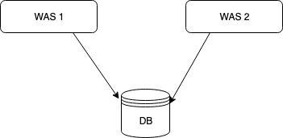
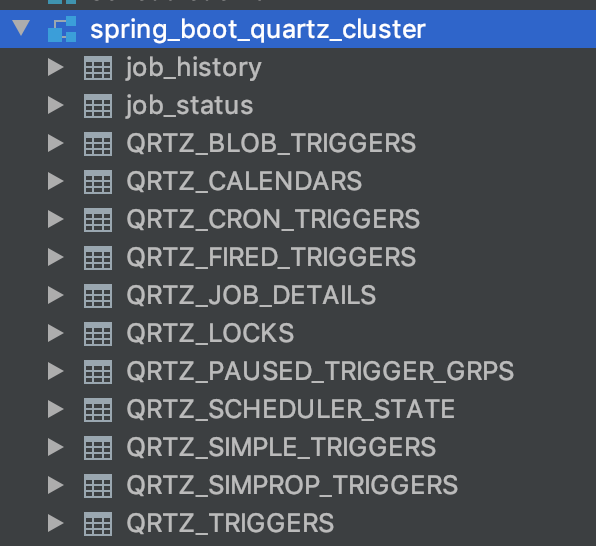
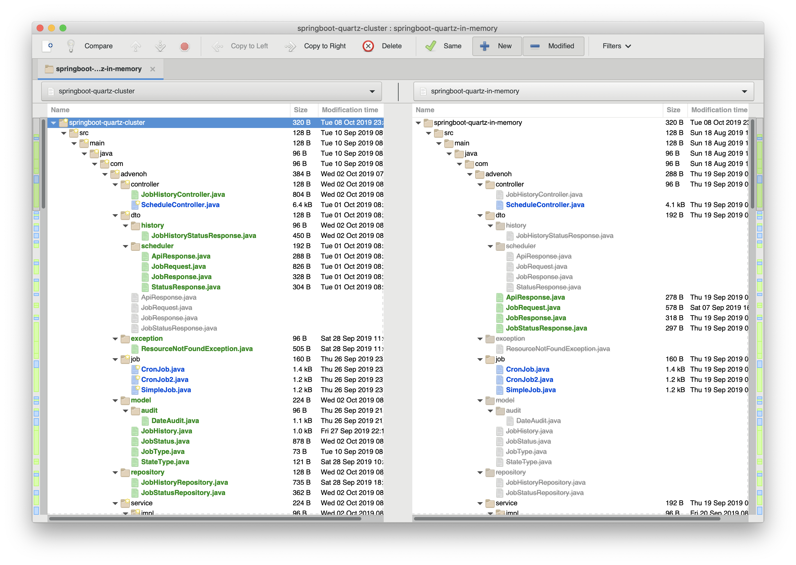
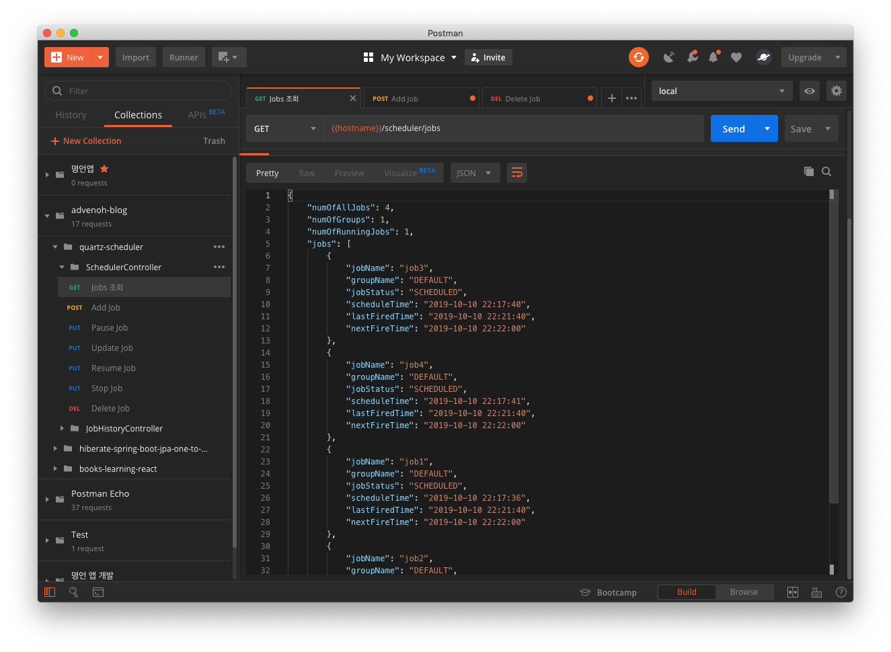

# 1. 들어가며

Quartz에서는 메모리 기반의 스케줄러뿐만이 아니라 DB 기반의 스케줄러도 지원합니다. DB 기반의 스케줄러의 경우에는 스케줄러 정보를 메모리가 아닌 DB에 저장하기 때문에 다중 서버 간의 스케줄링이 가능합니다. Quartz는 master-slave 형태로 서로 간의 통신을 하지 않고 단순히 DB 업데이트 정보를 기반으로 각각의 스케줄 인스턴스가 자기가 실행해야 하는 Job을 실행합니다.



Cluster 환경에서 스케줄링이 가능하기 때문에 Non-Cluster 환경에 비해 여러 가지 장점이 기본적으로 제공됩니다.

- 고가용성 (High Availability) 
  - 한 서버가 셧다운 되더라도 다른 서버에 의해 Job이 실행되어 다운 타임이 없다
- 확장성 (Scalability)
  - Quartz 설정된 서버를 구동하면 자동으로 DB에 스케줄 인스턴스로 등록된다
  - 셧다운 된 서버는 다른 서버에 의해서 DB에서 삭제된다
- 로드 밸런싱 (Load balancing)
  - Cluster 구성으로 여러 Job이 여러 서버에 분산되어 실행된다
  - 로드 밸런싱 알고리즘에는 Hashing, Round-robin 등등이 존재하지만, Quartz에서는 최소한의 구현으로 random 알고리즘만을 제공한다

# 2. 개발 환경

포스팅에서 작성한 코드는 아래 github 링크를 참조해주세요.

- OS : Mac OS
- IDE: Intellij
- Java : JDK 1.8
- Source code : [github](https://github.com/kenshin579/tutorials-java/tree/master/springboot-quartz-cluster)
- Software management tool : Maven

# 3. 스프링 부트 기반의 Quartz Cluster 스케줄러 구축

## 3.1 Quartz를 위한 DB 스키마 생성

DB 스키마는 Quartz의 [소스코드](https://github.com/quartz-scheduler/quartz/releases) 에 포함되어 있어서 원하는 DB 스키마를 소스코드에서 찾습니다. 저는 MySql를 사용하겠습니다.


```bash
$ cat tables_mysql_innodb.sql
```

```sql
…(생략)...
CREATE TABLE QRTZ_JOB_DETAILS(
SCHED_NAME VARCHAR(120) NOT NULL,
JOB_NAME VARCHAR(190) NOT NULL,
JOB_GROUP VARCHAR(190) NOT NULL,
DESCRIPTION VARCHAR(250) NULL,
JOB_CLASS_NAME VARCHAR(250) NOT NULL,
IS_DURABLE VARCHAR(1) NOT NULL,
IS_NONCONCURRENT VARCHAR(1) NOT NULL,
IS_UPDATE_DATA VARCHAR(1) NOT NULL,
REQUESTS_RECOVERY VARCHAR(1) NOT NULL,
JOB_DATA BLOB NULL,
PRIMARY KEY (SCHED_NAME,JOB_NAME,JOB_GROUP))
ENGINE=InnoDB;
…(생략)...
```

DB에 quartz용 database를 생성하고 schema script를 실행합니다.

```sql
mysql> CREATE DATABASE spring_boot_quartz_cluster
```



## 3.2 Maven 라이브러리 추가

Quartz Cluster 구성을 위해 스프링 부트에서 필요한 라이브러리를 추가합니다.

```xml
<dependency>
    <groupId>org.springframework.boot</groupId>
    <artifactId>spring-boot-starter-data-jpa</artifactId>
</dependency>
<dependency>
    <groupId>org.springframework.boot</groupId>
    <artifactId>spring-boot-starter-quartz</artifactId>
</dependency>
<dependency>
    <groupId>mysql</groupId>
    <artifactId>mysql-connector-java</artifactId>
    <version>5.1.48</version>
</dependency>
```

## 3.3 Quartz 관련 설정

### 3.3.1 DataSource 및 Quartz 속성값 설정하기

Spring Boot에서 dataSource 설정은 간단합니다. @EnableAutoConfiguration 어노테이션(@SpringBootApplication 어노테이션에 의해 포함됨)에 의해서 application.properties 내의 spring.datasource.\* 속성은 정의하면 자동으로 인식이 됩니다.

하지만, JavaConfig로 별도의 DataSource를 구현하여 Bean을 등록했다면 spring.datasource.\* 속성은 적용되지 않습니다.

```
## Spring DATASOURCE (DataSourceAutoConfiguration & DataSourceProperties)
spring.datasource.platform=org.hibernate.dialect.MySQL5Dialect
spring.datasource.driver-class-name=com.mysql.jdbc.Driver
spring.datasource.url=jdbc:mysql://localhost:3306/spring_boot_quartz_cluster?useSSL=false&serverTimezone=UTC&useLegacyDatetimeCode=false
spring.datasource.username=mybatis
spring.datasource.password=mybatis$
```

Quartz 속성에 대한 자세한 내용은 [Quartz 공식 페이지](http://www.quartz-scheduler.org/documentation/quartz-2.3.0/configuration/#configuration-reference) 를 참고해주세요. 개인적으로 이해 안 되었던 부분은 간단하게 추가 설명을 달았습니다.

```
#Quartz
spring.quartz.scheduler-name=QuartzScheduler
[spring.quartz.properties.org.quartz.scheduler.instanceId=AUTO](http://spring.quartz.properties.org.quartz.scheduler.instanceid=auto/)
[spring.quartz.properties.org.quartz.threadPool.threadCount=20](http://spring.quartz.properties.org.quartz.threadpool.threadcount=20/)
[spring.quartz.properties.org.quartz.jobStore.tablePrefix=QRTZ](http://spring.quartz.properties.org.quartz.jobstore.tableprefix=qrtz/) _
[spring.quartz.properties.org.quartz.jobStore.isClustered=true](http://spring.quartz.properties.org.quartz.jobstore.isclustered=true/)
[spring.quartz.properties.org.quartz.jobStore.class=org.quartz.impl.jdbcjobstore.JobStoreTX](http://spring.quartz.properties.org.quartz.jobstore.class=org.quartz.impl.jdbcjobstore.jobstoretx/)
[spring.quartz.properties.org.quartz.jobStore.driverDelegateClass=org.quartz.impl.jdbcjobstore.StdJDBCDelegate](http://spring.quartz.properties.org.quartz.jobstore.driverdelegateclass=org.quartz.impl.jdbcjobstore.stdjdbcdelegate/)
[spring.quartz.properties.org.quartz.jobStore.useProperties=true](http://spring.quartz.properties.org.quartz.jobstore.useproperties=true/)
[spring.quartz.properties.org.quartz.jobStore.misfireThreshold=60000](http://spring.quartz.properties.org.quartz.jobstore.misfirethreshold=60000/)
```

- jobStore.useProperties=true 
  - 이 값이 true이면 DB에 JobDataMaps에 저장되는 값이 binary가 아닌 string 값으로 저장된다
- jobStore.misfireThreshold=60000 (기본 값 : 1분)
  - Job이 실행되어야 하는데 서버가 셧다운 되었거나 쓰레드가 부족한 경우에 제시간에 실행이 안될 수 있는데 이 경우를 misfire (불발) 되었다고 한다
  - Trigger가 misfire된 것으로 간주되는 시간으로 1분이 지나면 misFire 되었다고 판단한다

### 3.3.2 Quartz에 dataSource 설정하기

SchedulerFactoryBean에 dataSource를 지정하면 됩니다.

```java
@Autowired
private DataSource dataSource;

@Bean
public SchedulerFactoryBean schedulerFactoryBean(ApplicationContext applicationContext) {
	…(생략)...
	schedulerFactoryBean.setDataSource(dataSource); 이 부분만 추가하면 된다
	schedulerFactoryBean.setQuartzProperties(properties);
	schedulerFactoryBean.setWaitForJobsToCompleteOnShutdown(true);
	return schedulerFactoryBean;
}
```

간단하죠? [메모리기반으로 작성된 Quartz 소스](https://blog.advenoh.pe.kr/java/20190909_Spring_Boot_Quartz%EC%9D%84_%EC%9D%B4%EC%9A%A9%ED%95%9C_Job_Scheduler_%EA%B5%AC%ED%98%84_In-memory/) 와 비교하면 어떻게 다르게 구성 되었는지 한 눈에 쉽게 파악할 수 있습니다. 파일이나 폴더를 비교하는 프로그램 중에 개인적으로 저는 [Meld](http://meldmerge.org/) 라는 오픈소스를 잘 사용합니다.

한번 설치해서 비교해보세요. 블로그보다 코드만 보고도 쉽게 파악할 수 있습니다.

```bash
$ brew cask install meld
$ cd tutorials-java
$ meld springboot-quartz-cluster/ springboot-quartz-in-memory
```



### 3.3.3 이중화 서버 구동

서버를 이중화로 구동했을 때도 이상이 없이 스케줄러가 잘 돌아가는지 확인해볼까요? 먼저 프로젝트를 복사할게요.

```bash
$ cp -r springboot-quartz-cluster/ springboot-quartz-cluster2
```

복사하고 나서 서버 포트를 다른 번호로 변경합니다.

```bash
$ cd springboot-quartz-cluster2
$ code src_main_resources/application.properties
server.port=7070

$ mvn spring-boot:run
```

서버를 각각 실행하고 나서 QRTZ\_SCHEDULER_STATE 테이블에서 2개의 인스턴스가 등록되었는지 확인합니다.

```sql
mysql> SELECT * FROM QRTZ_SCHEDULER_STATE;
```


Postman에서 임의로 job을 추가합니다.


GET /scheduler/jobs API로 조회해보면 잘 등록된 것을 확인할 수 있습니다.



각 WAS에서 job이 실행되는 것도 터미널에서 볼 수 있습니다. WAS1 (quartz-cluster)를 셧다운 시켜보면 WAS2 (quartz-cluster2)가 job을 픽업해서 이상 없이 실행하는 것을 확인할 수 있습니다.


## 3.4 Quartz Cluster 설정시 주의사항

- 서버 타임 동기화
  - Quartz는 내부적인 로직안에서 타임으로 판단하는 부분이 많아서 서버 타임 동기화는 필수이다
- Quartz 설정 튜닝
  - Job Workload Type에 따라서 Quartz 설정 튜닝이 필요하다
  - Long Jobs - 장시간 실행되는 Job (ex. CPU intensive)
  - Short Jobs - 짧게 실행되는 Job (ex. 1초마다 실행)
  - 특히 Short Job과 같은 경우에는 1초마다 실행되는 것을 보장해야 한다. 한 서버가 셧다운 되면 실행 중인 Job이 misfire 되고 다른 서버가 바로 이어서 실행해야 하는 조건이 있다면 튜닝은 필수이다 
    - 참고로 현재 운용 중인 서버에서 Short Jobs이 많아 아래와 같이 튜닝을 했다

```
#============================================================================
# Configure Main Scheduler Properties
#============================================================================
org.quartz.scheduler.instanceName=admin-tmon-media
org.quartz.scheduler.instanceId=AUTO
org.quartz.scheduler.batchTriggerAcquisitionMaxCount=20
org.quartz.scheduler.idleWaitTime=1000
org.quartz.scheduler.skipUpdateCheck=true

#============================================================================
# Configure ThreadPool
#============================================================================

org.quartz.threadPool.threadCount=20
org.quartz.threadPool.threadNamePrefix=QuartzScheduler

#============================================================================
# Configure JobStore
#============================================================================

org.quartz.jobStore.class=org.quartz.impl.jdbcjobstore.JobStoreCMT
org.quartz.jobStore.driverDelegateClass=org.quartz.impl.jdbcjobstore.StdJDBCDelegate
org.quartz.jobStore.useProperties=true
org.quartz.jobStore.misfireThreshold=1100
org.quartz.jobStore.tablePrefix=QRTZ\_
org.quartz.jobStore.isClustered=true
org.quartz.jobStore.clusterCheckinInterval=15000
org.quartz.jobStore.acquireTriggersWithinLock=true
```

## 3.5 Job History 기능

Quartz에서는 현재 실행되는 Job에 대해서만 관리하고 Job History에 대한 내용은 기록하지 않습니다. 나중에 어드민 UI 메인 페이지에 추가로 넣으면 좋을 것 같아서 이번에 작업을 같이했습니다. 이 내용은 어드민 UI 포스팅에서 다루도록 할게요.

# 4. 정리

Quartz Cluster 구성은 DB에 대한 dataSource 속성과 Cluster 관련 설정만 해주면 어렵지 않게 구성할 수 있습니다.

Quartz는 Cluster 환경으로 DB를 사용하고 DB에 접근할 때마다 lock을 걸고 정보를 업데이트합니다. Quartz 서버나 Short Jobs의 수가 많은 경우에는 lock이 더 많이 발생할 수 있어서 실행하려는 Job이 misfire 될 가능성이 커집니다. 이런 경우에는 Redis와 같은 다른 저장소를 사용하면 좋지 않을까 생각합니다.

Quartz에서는 기본적으로 2가지 저장소만 (Memory, DB) 제공하지만, Github에 Redis나 MongoDB와 같은 저장소에 저장할 수 있도록 구현체들이 있습니다. DB 실행 시 문제가 된다면 다른 저장소로 저장해보는 것도 좋을 듯해요.

# 5. 참고

- Quartz Cluster
  - [https://jeroenbellen.com/configuring-a-quartz-scheduler-in-a-clustered-spring-boot-application/](https://jeroenbellen.com/configuring-a-quartz-scheduler-in-a-clustered-spring-boot-application/)
  - [https://github.com/heidiks/spring-boot-quartz-cluster-environment](https://github.com/heidiks/spring-boot-quartz-cluster-environment)
  - [https://medium.com/@Hronom/spring-boot-quartz-scheduler-in-cluster-mode-457f4535104d](https://medium.com/@Hronom/spring-boot-quartz-scheduler-in-cluster-mode-457f4535104d)
  - [https://flylib.com/books/en/2.65.1/how_clustering_works_in_quartz.html](https://flylib.com/books/en/2.65.1/how_clustering_works_in_quartz.html)
  - [https://www.baeldung.com/spring-quartz-schedule](https://www.baeldung.com/spring-quartz-schedule)
  - [https://kingbbode.tistory.com/38](https://kingbbode.tistory.com/38) 
  - [https://www.callicoder.com/spring-boot-quartz-scheduler-email-scheduling-example/](https://www.callicoder.com/spring-boot-quartz-scheduler-email-scheduling-example/)
- 스프링부트에서 DataSource 설정하는 방법 
  - [https://www.holaxprogramming.com/2015/10/16/spring-boot-with-jdbc/](https://www.holaxprogramming.com/2015/10/16/spring-boot-with-jdbc/)
- JPA page관련 unit test 
  - [https://velog.io/@jayjay28/JPA를-이용한-단순-게시물-처리](https://velog.io/@jayjay28/JPA%EB%A5%BC-%EC%9D%B4%EC%9A%A9%ED%95%9C-%EB%8B%A8%EC%88%9C-%EA%B2%8C%EC%8B%9C%EB%AC%BC-%EC%B2%98%EB%A6%AC)
- JobStore
  - [https://dzone.com/articles/using-quartz-for-scheduling-with-mongodb](https://dzone.com/articles/using-quartz-for-scheduling-with-mongodb)
  - [https://github.com/jlinn/quartz-redis-jobstore](https://github.com/jlinn/quartz-redis-jobstore)
- Misfire
  - [https://dzone.com/articles/quartz-scheduler-misfire](https://dzone.com/articles/quartz-scheduler-misfire)
  - [https://stackoverflow.com/questions/32075128/avoiding-misfires-with-quartz](https://stackoverflow.com/questions/32075128/avoiding-misfires-with-quartz)
  - [https://www.nurkiewicz.com/2012/04/quartz-scheduler-misfire-instructions.html](https://www.nurkiewicz.com/2012/04/quartz-scheduler-misfire-instructions.html)
- Short Running Jobs
  - [https://airboxlab.github.io/performance/scalability/scheduler/quartz/2017/06/20/perf_tuning_quartz.html](https://airboxlab.github.io/performance/scalability/scheduler/quartz/2017/06/20/perf_tuning_quartz.html)
  - [https://www.ebayinc.com/stories/blogs/tech/performance-tuning-on-quartz-scheduler/](https://www.ebayinc.com/stories/blogs/tech/performance-tuning-on-quartz-scheduler/)
