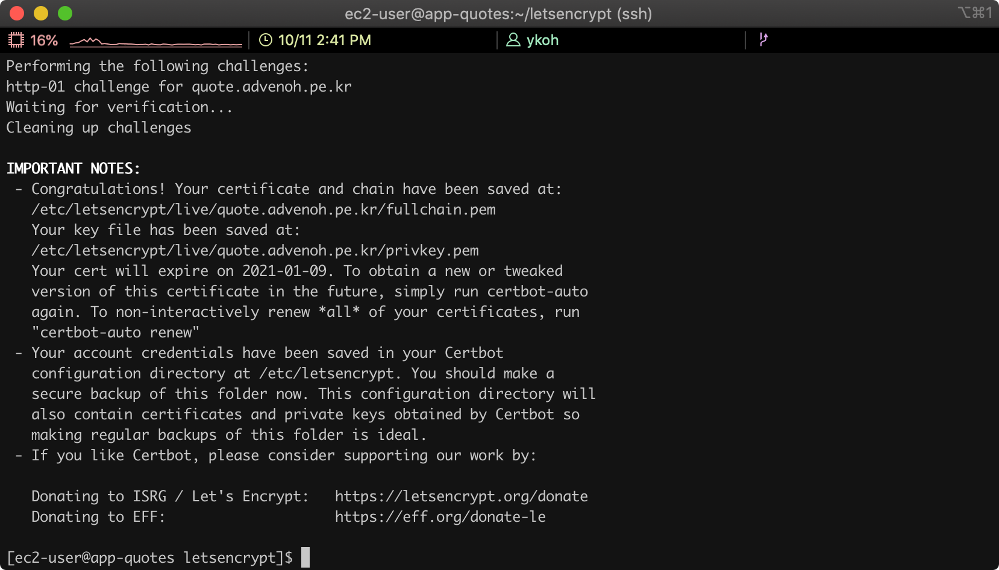

# 1. 들어가며

웹사이트를 HTTPS로 설정하는 방법에 대해서 알아보자. HTTP -> HTTPS로 적용하려면 아래 절차가 필요하다. 

- SSL 인증서 발급 받기
  - [letsencrypt](https://letsencrypt.org/)에서 SSL 인증서를 무료로 받을 수 있다
- 서버에 SSL 인증서 설치 및 웹 서버 설정하기

## 1.1 개발환경

- 서버 : Amazon Linux
- 웹 서버 : Nginx 서버
- 적용 사이트 : http://quote.advenoh.pe.kr

#2.  도구 설치 및 환경 설정

## 2.1 Certbot로 인증서 설치하기

Let's Encrypt에서는 certbot 명령어를 제공하여 Let's Encrypt 인증서를 자동으로 발급받거나 개신 할 수 있다. 

먼저 certbot 명령어를 설치한다. 

```bash
$ git clone https://github.com/letsencrypt/letsencrypt
```

standalone 방식으로 인증서를 생성해보자. 

```bash
$ cd letsencrypt
$ ./certbot-auto certonly --standalone --debug -d quote.advenoh.pe.kr
```

standalone 방식은 certbot이 간이 웹 서버를 돌려 도메인 인증 요청을 처리하는 방식이다. 간이 서버가 80, 443번 포트를 사용하기 때문에 ngnix 서버가 같은 포트를 사용하면 인증서 발급이 안된다. 

certbot 실행하기 전에 ngnix 서비스를 종료시켜두자. 

```bash
$ sudo service nginx stop
```

이상없이 생성되었으면 아래 화면과 같이 메시지를 볼 수 있다. 



## 2.2 Ngnix 서버 설정 변경하기

이제 ngnix 웹 서버에 HTTPS 설정을 추가해보자. 

```bash
$ vim /etc/ngnix/nginx.conf
```

80 관련 server 설정 아래 추가로 아래를 넣어주자. 

```bash
server {
        listen       443 ssl;
        listen       [::]:443;
        server_name  quote.advenoh.pe.kr;
        root         /usr/share/nginx/html;

        ssl_certificate "/etc/letsencrypt/live/quote.advenoh.pe.kr/fullchain.pem";
        ssl_certificate_key "/etc/letsencrypt/live/quote.advenoh.pe.kr/privkey.pem";
        ssl_session_cache shared:SSL:1m;
        ssl_session_timeout  10m;

        # Load configuration files for the default server block.
        include /etc/nginx/default.d/*.conf;
        include /etc/nginx/conf.d/service-url.inc;

        location / {
            proxy_pass $service_url;
            proxy_set_header X-Real-IP $remote_addr;
            proxy_set_header X-Forwarded-For $proxy_add_x_forwarded_for;
            proxy_set_header X-Forwarded-Proto https;
            proxy_set_header Host $http_host;
        }

        error_page 404 /404.html;
            location = /40x.html {
        }

				error_page 500 502 503 504 /50x.html;
            location = /50x.html {
        }
}

```

Ngnix 서버를 재시작하고 https 주소로 접속해보자.

```bash
$ sudo service nginx restart
```


## 2.3 Troubleshooting 및 기타 설정

### 2.3.1 Let's Encrypt 인증서 자동으로 갱신하기

Let's Encrypt 인증서는 3개월마다 개신을 해줘야 한다. cron 설정으로 자동으로 개신할 수 있도록 설정해두자. 

```bash
$ sudo crontab -e 
0 10 9 */3 * /home/ec2-user/letsencrypt/certbot-auto renew
0 10 9 */3 * service ngnix restart
```


### 2.3.2 Problem binding to port 80 오류 메시지

ngnix 서버를 종료시키고 다시 certbot을 실행하면 된다. 

```bash
- - - - - - - - - - - - - - - - - - - - - - - - - - - - - - - - - - - - - - - -
Would you be willing, once your first certificate is successfully issued, to
share your email address with the Electronic Frontier Foundation, a founding
partner of the Let's Encrypt project and the non-profit organization that
develops Certbot? We'd like to send you email about our work encrypting the web,
EFF news, campaigns, and ways to support digital freedom.
- - - - - - - - - - - - - - - - - - - - - - - - - - - - - - - - - - - - - - - -
(Y)es/(N)o: n
Obtaining a new certificate
Performing the following challenges:
http-01 challenge for quote.advenoh.pe.kr
Cleaning up challenges
Exiting abnormally:
Traceback (most recent call last):
  File "/opt/eff.org/certbot/venv/bin/letsencrypt", line 11, in <module>
    sys.exit(main())
  File "/opt/eff.org/certbot/venv/local/lib/python2.7/site-packages/certbot/main.py", line 15, in main
    return internal_main.main(cli_args)
  File "/opt/eff.org/certbot/venv/local/lib/python2.7/site-packages/certbot/_internal/main.py", line 1362, in main
    return config.func(config, plugins)
  File "/opt/eff.org/certbot/venv/local/lib/python2.7/site-packages/certbot/_internal/main.py", line 1243, in certonly
    lineage = _get_and_save_cert(le_client, config, domains, certname, lineage)
  File "/opt/eff.org/certbot/venv/local/lib/python2.7/site-packages/certbot/_internal/main.py", line 122, in _get_and_save_cert
    lineage = le_client.obtain_and_enroll_certificate(domains, certname)
  File "/opt/eff.org/certbot/venv/local/lib/python2.7/site-packages/certbot/_internal/client.py", line 418, in obtain_and_enroll_certificate
    cert, chain, key, _ = self.obtain_certificate(domains)
  File "/opt/eff.org/certbot/venv/local/lib/python2.7/site-packages/certbot/_internal/client.py", line 351, in obtain_certificate
    orderr = self._get_order_and_authorizations(csr.data, self.config.allow_subset_of_names)
  File "/opt/eff.org/certbot/venv/local/lib/python2.7/site-packages/certbot/_internal/client.py", line 398, in _get_order_and_authorizations
    authzr = self.auth_handler.handle_authorizations(orderr, best_effort)
  File "/opt/eff.org/certbot/venv/local/lib/python2.7/site-packages/certbot/_internal/auth_handler.py", line 70, in handle_authorizations
    resps = self.auth.perform(achalls)
  File "/opt/eff.org/certbot/venv/local/lib/python2.7/site-packages/certbot/_internal/plugins/standalone.py", line 156, in perform
    return [self._try_perform_single(achall) for achall in achalls]
  File "/opt/eff.org/certbot/venv/local/lib/python2.7/site-packages/certbot/_internal/plugins/standalone.py", line 163, in _try_perform_single
    _handle_perform_error(error)
  File "/opt/eff.org/certbot/venv/local/lib/python2.7/site-packages/certbot/_internal/plugins/standalone.py", line 210, in _handle_perform_error
    raise error
StandaloneBindError: Problem binding to port 80: Could not bind to IPv4 or IPv6.
Please see the logfiles in /var/log/letsencrypt for more details.

```


### 2.3.3 http -> https redirect 시키기

http 접속시 https로 redirect 하도록 ngnix 설정을 변경하자. 

```bash
server {
        listen       80 default_server;
        listen       [::]:80 default_server;
        server_name  quote.advenoh.pe.kr;
        return 301 https://$server_name:$request_uri;
}
```

#3.  마무리

letsencrypt에서 SSL 인증서를 무료로 제공하고 쉽게 설치할 수 있는 certbot도 제공한다. certbot 명령어로 거의 5분 안에 https를 설정할 수 있었다. 전체 ngnix은 [gist](https://gist.github.com/kenshin579/489a13d194e310ec741f64f508c1f987)를 참고해주세요. 

#4. 참고

* SSL 인증서 설치
  * https://levelup.gitconnected.com/how-to-install-ssl-certificate-for-nginx-server-in-amazon-linux-2986f51371fb
  * https://medium.com/@devAsterisk/certbot%EC%9D%84-%ED%86%B5%ED%95%9C-%EB%AC%B4%EB%A3%8C%EC%9D%B8%EC%A6%9D%EC%84%9C-%EC%83%9D%EC%84%B1-707f86b642d1
  * https://elfinlas.github.io/2018/03/19/certbot-ssl/
* Cron 표현식
  * https://crontab.guru/#0_10_9_*/3_*
