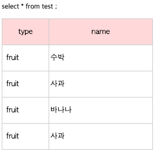
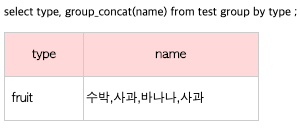

개인적으로 모르는 부분 적어두고 알게 되는 부분에 대해서 간단하게 정리해둔 자료입니다.
미 답변중에 알고 계신 부분 있으면 코멘트 달아주세요. 감사합니다.

### [Q&A 전체 목록](https://advenoh.tistory.com/35)

### <span style="color:orange">[미 답변 질문]</span>

- 하나의 행의 값을 복사하되 몇 열 값만 변경하고 싶을 때?

참고
* [https://stackoverflow.com/questions/2783150/mysql-how-to-copy-rows-but-change-a-few-fields](https://stackoverflow.com/questions/2783150/mysql-how-to-copy-rows-but-change-a-few-fields)


-  데이터 migration은 어떻게 하나? 예. 한 테이블에 있는 데이터를 분리하는 작업은 어떻게 진행하면 되나?
```sql
INSERT INTO ` tmon_media ` . ` media_live_job ` ( ` live_seqno ` , ` job_id ` , ` strm_stts ` , ` rtmp_url ` , ` rtmp_key ` , ` playback_url ` , ` original_repo ` , ` original_file_nm ` ,
` video_rt ` , ` start_dt ` , ` finished_dt ` , ` use_yn ` , ` creator ` , ` create_dt ` , ` updater ` , ` update_dt ` )
SELECT ` live_seqno ` , ` live_job_id ` AS ` job_id ` , ` strm_stts ` , ` rtmp_stream_url ` , ` rtmp_stream_key ` , ` playback_url ` , ` original_repo ` , ` original_file_nm ` ,
` video_rt ` , NOW() AS ` start_dt ` , NOW()+INTERVAL 1 MINUTE AS ` finished_dt ` , 'Y' AS ` use_yn ` , 'tvon' AS ` creator ` ,
` create_tm ` AS ` create_dt ` , 'brightcov' AS ` updater ` , ` update_tm ` AS ` update_dt `
FROM ` tmon_media ` . ` media_info_live ` WHERE ` live_job_id ` IS NOT NULL;
```

- 테이블 복사는 어떻게 하나?

```sql
INSERT INTO tmon_media.media_info_live SELECT * FROM tmon_media.bak_media_info_live;
```

- group_concat이란?






참고

* [https://fruitdev.tistory.com/16](https://fruitdev.tistory.com/16)

- - - -

### <span style="color:orange">[답변완료]</span>

### <span style="color:brown">1. 테이블 생성시 InnoDB를 왜 설정해야 하나?</span>


MySQL의 Storage Engine에는 여러 가지가 존재합니다. 제일 많이 사용되는 버전은 MyISAM와 InnoDB입니다. 테이블 생성시 어떤 엔진을 사용할 지 설정할 수 있습니다.


참고
* MyISAM vs. InnoDB
	* [https://ojava.tistory.com/25](https://ojava.tistory.com/25)

### <span style="color:brown">2. 왜 auto_increment를 하면 1로 증가하지 않고 4씩 증가하나?</span>

기본 설정은 1씩 증가하지만 auto_increment_increment 값을 다르게 설정하면 지정한 값만큼 증가하게 됩니다.

```sql
mysql> show variables like 'auto_inc%’;
```


참고
* [https://dba.stackexchange.com/questions/60295/why-does-auto-increment-jumps-by-more-than-the-number-of-rows-inserted](https://dba.stackexchange.com/questions/60295/why-does-auto-increment-jumps-by-more-than-the-number-of-rows-inserted)
* [https://stackoverflow.com/questions/206751/mysql-autoincrement-column-jumps-by-10-why](https://stackoverflow.com/questions/206751/mysql-autoincrement-column-jumps-by-10-why)

### <span style="color:brown">3. Sql 문구에서 가끔씩 '@변수 := …’ 를 발견했다. 무슨 의미일까? </span>


사용자 정의 변수를 저장할 때 사용합니다. 이 경우에는 SELECT로 구한 media_no 값을 mediaNo 변수에 저장합니다.

참고
* [http://www.mysqlkorea.com/sub.html?mcode=manual&scode=01&m_no=21582&cat1=9&cat2=292&cat3=0&lang=k](http://www.mysqlkorea.com/sub.html?mcode=manual&amp;scode=01&amp;m_no=21582&amp;cat1=9&amp;cat2=292&amp;cat3=0&amp;lang=k)
* [https://crazyj.tistory.com/m/110?category=802841](https://crazyj.tistory.com/m/110?category=802841)

### <span style="color:brown">4. COUNT(*) vs COUNT(1) vs COUNT(pk)의 차이점? </span>

* COUNT(*)
	* 행의 개수를 카운트한다
	* NULL도 포함해서 카운트한다
* COUNT(1)
	* 행의 개수를 카운트하지만, 하나의 테이블에 대해서만 쿼리가 되고 JOIN한 Table 쿼리를 안된다
	* 사용하지 말라는 의견이 있다
* COUNT(pk)
	* NULL아 아닌것만 카운트한다

참고
* [https://stackoverflow.com/questions/2710621/count-vs-count1-vs-countpk-which-is-better](https://stackoverflow.com/questions/2710621/count-vs-count1-vs-countpk-which-is-better)

### <span style="color:brown">5. IFNULL() 함수?</span>

IFNULL(expression, alt_value) 형식으로 expressoin이 NULL이면 alt_value를 반환합니다.


참고
* [https://www.w3schools.com/sql/func_mysql_ifnull.asp](https://www.w3schools.com/sql/func_mysql_ifnull.asp)

### <span style="color:brown">6. 'order by 2,1’는 어떻게 정렬을 하라는 건가? <span>

두번째 컬럼으로 정렬하고 중복 값이 있는 경우에는 첫번째 컬럼으로 정렬하라는 의미입니다.

참고

* [http://www.itmembers.net/board/view.php?id=oracle&page=2&sn1=&divpage=1&sn=off&ss=on&sc=on&select_arrange=headnum&desc=asc&no=29](http://www.itmembers.net/board/view.php?id=oracle&amp;page=2&amp;sn1=&amp;divpage=1&amp;sn=off&amp;ss=on&amp;sc=on&amp;select_arrange=headnum&amp;desc=asc&amp;no=29)

### <span style="color:brown">7. MySQL Error 1093 : You can’t specify target table ..for update in FROM clause가 발생하는 경우, 어떻게 처리하면 되나? </span>

아래 SQL 실행시 오류가 발생하였습니다.

```sql
UPDATE ` tmon_media ` . ` media_external_trans `
SET use_yn = 'Y'
WHERE trans_seqno IN (SELECT trans_seqno FROM media_external_trans as t where t.trans_seqno > 3162);

```

원인은 MySQL은 Oracle과 달리게 UPDATE나 DELETE 할때 자기 테이블의 데이터를 바로 사용하지 못하는 이슈가 있어서 서브 쿼리를 하나 더 생성하여 임시 테이블을 만들어서 해결하면 됩니다.

해결


참고

* [https://www.lesstif.com/display/DBMS/MySQL+Error+1093+%3A+You+can%27t+specify+target+table+%27cwd_group%27+for+update+in+FROM+clause](https://www.lesstif.com/display/DBMS/MySQL+Error+1093+%3A+You+can%27t+specify+target+table+%27cwd_group%27+for+update+in+FROM+clause)

### <span style="color:brown">8. MySql에서 모든 query에 대해서 로깅을 하려면 어떻게 해야 하나?</span>

MySql 설정에서 general_log을 활성화시켜면 됩니다.

```sql
mysql> set global general_log=ON;
mysql> show variables like ‘general%’;
```

참고
* [https://skibis.tistory.com/75](https://skibis.tistory.com/75)

### <span style="color:brown">9. MySql에서 general_log가 활성화되어 있지 않는 경우 query를 확인하는 방법은 없나? </span>

MySql 실행시 모든 명령문을 bin log로 저장한다면 확인할 수 있습니다. bin log 로그 분석에 대한 자세한 사항은 아래 링크를 참조해주세요.

참고
* [http://www.enjoyteam.net/?p=128](http://www.enjoyteam.net/?p=128)
* [http://www.mysqlkorea.com/sub.html?mcode=manual&scode=01_1&m_no=22368&cat1=752&cat2=799&cat3=927&lang=k](http://www.mysqlkorea.com/sub.html?mcode=manual&amp;scode=01_1&amp;m_no=22368&amp;cat1=752&amp;cat2=799&amp;cat3=927&amp;lang=k)
* [http://blog.naver.com/PostView.nhn?blogId=ncloud24&logNo=221055112009&parentCategoryNo=&categoryNo=79&viewDate=&isShowPopularPosts=false&from=postView](http://blog.naver.com/PostView.nhn?blogId=ncloud24&amp;logNo=221055112009&amp;parentCategoryNo=&amp;categoryNo=79&amp;viewDate=&amp;isShowPopularPosts=false&amp;from=postView)

### <span style="color:brown">10. Slow Query란?</span>

Slow Query란 말 그래도 query 수행시 오래 걸리는 쿼리를 의미합니다.

참고

* [https://itstudyblog.tistory.com/384](https://itstudyblog.tistory.com/384)

### <span style="color:brown">11. 페이징에서 offset과 limit은 어떻게 사용되나?</span>

많은 데이터를 한번에 가져올 수 없기 때문에 페이징으로 부분적으로 데이터를 가져올 때 LIMIT과 OFFSET을 사용합니다.

* LIMIT : 가져올 데이터의 개수
* OFFSET : 검색된 데이터중에서 몇번째부터 가져올 것인지 정하는 시작번호

참고
* [https://needjarvis.tistory.com/259](https://needjarvis.tistory.com/259)
* [http://avilos.codes/database/mysql/mysql-pagination/](http://avilos.codes/database/mysql/mysql-pagination/)

### <span style="color:brown">12. Server time zone value ‘KST’ is unrecognized… 오류 메시지가 나는 경우 해결책은?</span>

여러 사항에 따라서 해결 방법이 다를 것으로 판단됩니다. 저희 경우에는 pom.xml에서 mysql-connector-java의 버전(ex. 8.0.13 —> 5.1.47)을 변경해서 해결했습니다.


참고
* [https://offbyone.tistory.com/318](https://offbyone.tistory.com/318)

### <span style="color:brown">13. 변수에 지정한 값 출력을 어떻게 하나?</span>


SELECT @lastMediaNo로 실행하면 됩니다.

참고
* [https://stackoverflow.com/questions/40905427/how-to-print-the-string-variable-in-mysql](https://stackoverflow.com/questions/40905427/how-to-print-the-string-variable-in-mysql)
