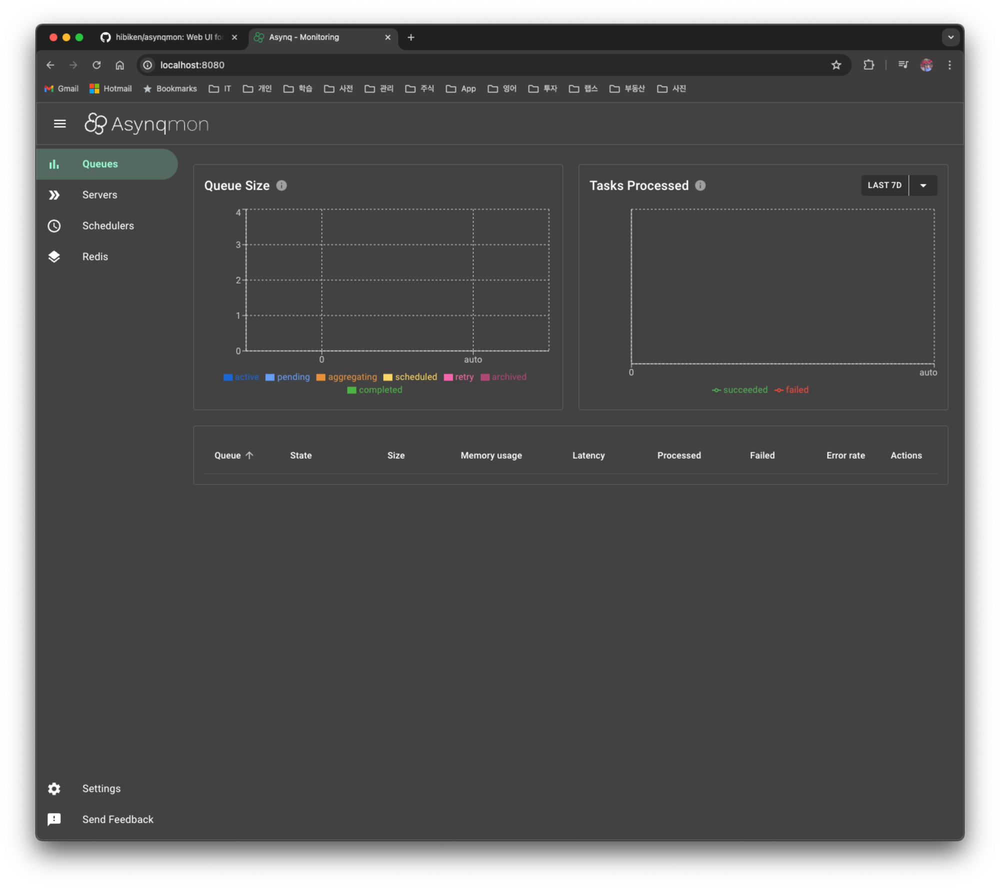
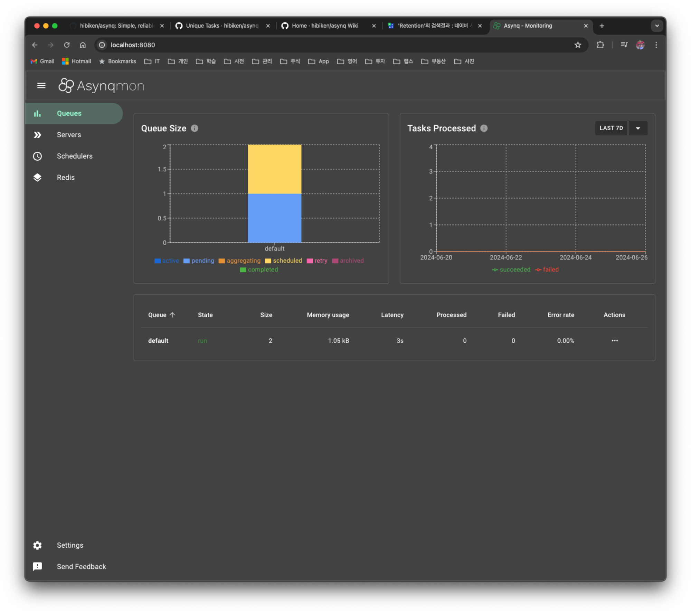
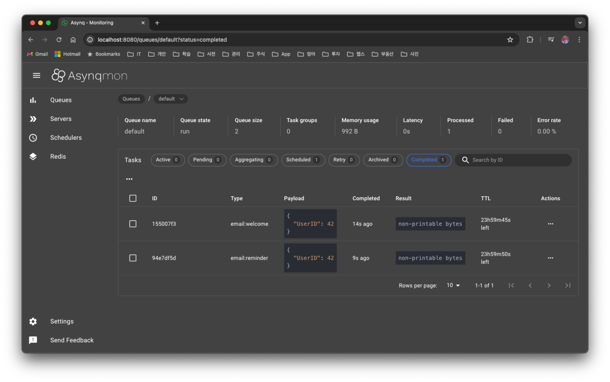
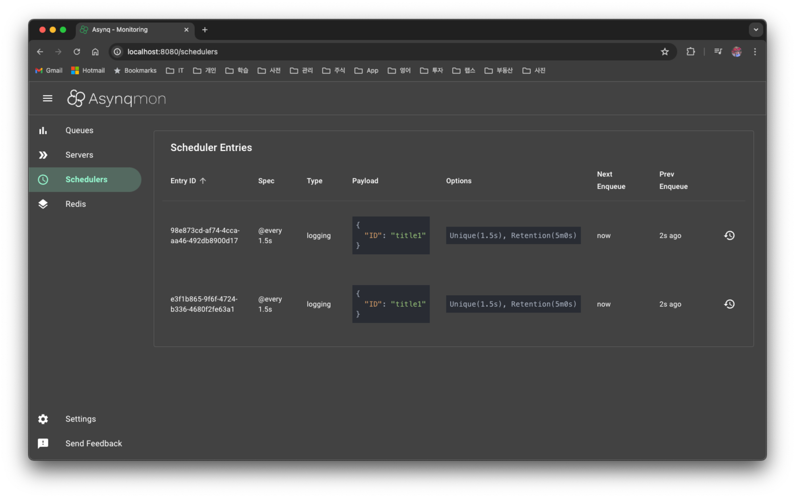

# 1. 개요

서버 개발을 하다 보면 다양한 작업을 백그라운드에서 처리해야 하는 상황이 자주 발생한다. 이러한 작업은 주기적으로 실행되거나, 특정 이벤트에 반응하여 실행된다. 이 때문에 서버 개발에서 스케줄러가 필수적인 기능이기도 하다. 또한 서버 이중화를 위해 분산 환경에서 다중 서버에서도 스케줄링이 원활하게 동작할 수 있어야 한다.

스프링으로 개발하고 있다면 스프링에서 제공하는 Quartz를 이용하면 된다. Quartz 꽤 오래된 프로젝트라서 스프링에서는 de facto로 사용되고 있다. Golang으로 개발한 서버에서도 분산 스케줄러를 개발해야 해서 어떤 걸 사용하면 좋은지 검토를 해보았다.

## 1.1 golang 스케줄러

- `Asynq`
  - Job 정보를 redis 서버에 저장하고 여러 인스턴스를 띄워도 트리거하는 주기가 짧아지는 이슈는 없다
- `go-cron`
  - Redislock 으로 한 서버에서 실행 가능하도록 하지만, 서버의 수가 늘어나면 트리거하는 주기가 더 짧아지는 이슈가 있다
- `quartz`
  - 스프링 Quartz 구현에서 영감을 얻어 시작된 버전이지만, 분산 스케줄러 지원은 하지 않는다
- `dcron`
  - Redis 명령어로 atomic 하게 실행되지만, go-cron가 가지고 있는 trigger 이슈는 동일하게 가지고 있다
- `work`
  - 최신 업데이트가 없는 걸로 봐서는 유지보수가 안되는 것으로 판단된다
- 다른 스케줄러도 검토해봤지만, 큰 의미가 없어서 생략한다

조사해 본 결과 `Asynq` 스케줄러가 그래도 제일 괜찮은 스케줄러라고 생각이 들어서 조금 더 조사한 내용을 정리해 본다.

참고

- https://awesome-go.com/job-scheduler/

# 2. `Asynq` 기능에 대한 정리

`Asynq`는 task 를 queue에 넣고 비동기적으로 worker가 task를 처리하는 library 이다. 내부에서 사용하는 정보 (ex. task, scheduler)는 redis에 저장하고 있다

### 2.1 기본 동작

- `Asynq`는 분산 락을 사용하지 않고 queue에 task를 넣고 server가 queue에서 task를 가져가서 각 worker goroutine 에서 처리하도록 내부적으로 동작한다
- task는 두가지 방식으로 추가 할 수 있다 (redis에 저장됨)
  - `Asynq` client로 task를 queue에 넣거나
  - 주기적으로 실행할 수 있도록 periodic task (cron)로 등록할 수 있다
- 여러 queue에 우선순위 설정도 가능하다


## 2.2 주 기능

제공하는 기능이 많지만, 주로 지금 개발하는 어플리케이션에서 필요하다고 생각되는 것 위주로 정리했다.

- 최소 한 번의 작업 실행을 보장한다
  - 서버 인스턴스 수가 늘어나도 트리거 하는 주기가 달라지지 않는다
- Periodic Tasks 주기적인 작업 등록 가능하다
  - 주기 작업은 golang [cron](https://github.com/robfig/cron) library 사용해서 구현이 되어 있다
  - 주기 작업에 대한 정보는 5초마다 주기적으로 redis에 쓰여지고 있다
- 중복 task 등록에 대한 설정 지원을 한다
- Redis 지원한다
  - redis cluster, sentinel
- Prometheus 연동을 지원을 해서 queue 에 대한 metrics 를 수집하고 시각화 할 수 있다
- Web UI, [asynmon](https://github.com/hibiken/asynqmon) 도 지원한다
- CLI 를 지원해서 queue 정보를 확인할 수 있다

## 2.3 샘플 코드

`Async`에서는 DB로 Redis를 사용하고 있어서 redis 서버를 아래 명령어로 실행시킨다.

```bash
> cd cloud/docker/redis
> make redis-create
```

> 코드가 unit test로 작성이 되어 있어서 testcontainers로 redis 실행할 수 있는데, 귀찮아서 refactoring은 하지 않았습니다 ^^

### 2.3.1 asynmon UI를 실행하기

`asynmon` UI에서 redis에 저장되는 정보를 쉽게 확인할 수 있어서 `asynmon`을 먼저 실행한다.

```bash
> git clone <https://github.com/hibiken/asynqmon>
> cd asynqmon
> make docker
```

http://localhost:8080로 접속하면 아래와 같이 확인이 뜬다.



### 2.3.1 한번만 실행하는 경우

아래 코드는 실제로는 task를 실행시키지는 않고 단순히 task를 redis에 저장하는 역할을 한다. `Enqueue()`로 task를 등록할 때, 여러 옵션을 줄 수 있는데, 자주 사용하는 옵션만 언급하고 넘어간다.

- `asynq.Queue("queue1")`
  - Queue 이름을 지정할 수 있는 옵션으로 지정하지 않는 경우에는 `default` 값으로 queue가 생성이 된다

- `asynq.ProcessIn(2*time.Second)`
  - 현재 시간 기준으로 2초 뒤에 실행 한다는 의미이다

- `asynq.Retention(24*time.Hour)`
  - task 실행 후 결과를 얼마나 유지할 지 결정하는 옵션이다

- `asynq.Unique(1*time.Second)`
  - 이 시간 동안 lock이 걸려서 다른 task가 실행하지 못하게 하는 옵션이다

- `asynq.TaskID("task1")`

  - `TaskID`로 task id를 지정할 수 있다. 지정하지 않으면 random 값을 사용한다
  - 같은 taskID가 등록이 되면 `ErrDuplicateTask` 오류를 반환한다

```go
func Test_Async_Client(t *testing.T) {
	client := asynq.NewClient(asynq.RedisClientOpt{Addr: "localhost:6379"})

	t1, err := tasks.NewWelcomeEmailTask(42)
	if err != nil {
		log.Fatal(err)
	}

	t2, err := tasks.NewReminderEmailTask(42)
	if err != nil {
		log.Fatal(err)
	}

	// Process the task immediately.
	info, err := client.Enqueue(t1, asynq.Retention(24*time.Hour))
	if err != nil {
		log.Fatal(err)
	}
	log.Printf(" [*] Successfully enqueued task: %+v", info)

	// Process the task 24 hours later.
	info, err = client.Enqueue(t2, asynq.ProcessIn(2*time.Second), asynq.Retention(24*time.Hour))
	if err != nil {
		log.Fatal(err)
	}
	log.Printf(" [*] Successfully enqueued task: %+v", info)
}
```

코드를 실행하면 default queue에 2개의 task가 추가 된 것을 확인할 수 있다.



Task가 등록만 되어서 실제로 task를 실행하려면 `asynq` 서버를 실행시켜야 한다.

```bash
func Test_Workers2a(t *testing.T) {
	srv := asynq.NewServer(
		asynq.RedisClientOpt{Addr: "localhost:6379"},
		asynq.Config{Concurrency: 5},
	)

	mux := asynq.NewServeMux()
	mux.HandleFunc(tasks.TypeWelcomeEmail, tasks.HandleWelcomeEmailTask)
	mux.HandleFunc(tasks.TypeReminderEmail, tasks.HandleReminderEmailTask)
	mux.HandleFunc(tasks.TypeLogging, tasks.HandleLoggingTask)

	if err := srv.Run(mux); err != nil {
		log.Fatal(err)
	}
}
```

실행이 잘되었는지는 `asynqmon`에서 쉽게 확인할 수 있다.

> `Rentention` 옵션으로 task가 등록이 되어 Completed 란에서 실행 결과를 확인할 수 있다.



### 2.3.2 주기적인 작업 실행

주기적으로 실행하려면, `asynq.NewScheduler`로`asynq.Scheduler`객체를 생성하고 `Register()` 메서드로 task를 등록하면 된다. 주기적인 작업 Task 등록 시점은 서버를 시작하는 시점에 등록하면 된다. 하지만, 분산 환경에서 여러 서버에서 스케줄러를 실행하는 경우에는 중복으로 등록되어 의도와 달리 여러 번 실행하게 되는 이슈가 있다.

> `asynq`에서는 여러 서버에 같은 task는 하나만 등록하는 방법은 존재를 하지 않는다

```go
func Test_Periodic_Tasks(t *testing.T) {
	redisOpt := asynq.RedisClientOpt{Addr: redisAddr}
	ctx := context.Background()
	redisClient := newRedisClient()
	defer func() {
		redisClient.Close()
	}()

	maxGoroutine := 2

	type schedulerInfo struct {
		scheduler *asynq.Scheduler
		entryID   string
	}

	schedulerInfoMap := make(map[int]schedulerInfo)

	for i := 1; i <= maxGoroutine; i++ {
		go func(i int) {
			scheduler := asynq.NewScheduler(redisOpt, nil)
			// schedulers = append(schedulers, scheduler)

			// You can use cron spec string to specify the schedule.
			loggingTask, err := tasks.NewLoggingTask("title1")
			assert.NoError(t, err)

			// instance 2개: trigger도 잘되는 거 확인함
			entryID, err := scheduler.Register("@every 1.5s", loggingTask, asynq.Unique(1500*time.Millisecond), asynq.Retention(5*time.Minute))
			if err != nil {
				log.Fatal(err)
			}
			log.Printf("registered an entry: %q\\n", entryID)

			schedulerInfoMap[i] = schedulerInfo{scheduler: scheduler, entryID: entryID}

			if err := scheduler.Start(); err != nil {
				log.Fatal(err)
			}
			log.Printf("running scheduler...")

			// 주기 작업은 Register 등록하면 cron library에 의해서 실행이 되고 주기 작업 정보는 redis에 5초마다 쓰여진다
			time.Sleep(1 * time.Second)
			keys := redisClient.Keys(ctx, "asynq:schedulers*")
			assert.NoError(t, err)
			fmt.Printf("keys: %v\\n", keys)

		}(i)
	}

	time.Sleep(60 * time.Second)

	for _, schedulerInfo := range schedulerInfoMap {
		assert.NoError(t, schedulerInfo.scheduler.Unregister(schedulerInfo.entryID))
		schedulerInfo.scheduler.Shutdown()
	}

}
```

같은 Task가 여러 번 등록이 되더라도 한 번만 실행하는 해결책은 `asynq` Github Issue에 제시된 해결책이 있어서 적용해 보았다.

### 중복 실행을 방지하는 위한 해결책

1.`asynq.TaskID`, `asynq.Retention` 이 두 옵션을 사용한다
   - 실험 결과 주기가 일정하지 않다. 2초로 실행하라고 했는데, 3,4초에 실행되는 이슈가 있었다

2. Unique Tasks ← 이걸로 선택함
   - Task 등록시 `asynq.Unique(1500*time.Millisecond)` 이 옵션을 사용하면 실행하는 시간동안 RedisLock을 사용해서 서버 인스턴스가 늘어나도 중복으로 여러 번 실행되지 않고 설정한 일정한 주기로 실행된다

참고

- [**How to prevent duplicate scheduler task registe across multiple Asynq server nodes**](https://github.com/hibiken/asynq/issues/653)
- [**[FEATURE REQUEST\] Distributed Scheduler**](https://github.com/hibiken/asynq/issues/395)

2개 인스턴스로 실행하면 주기적인 Task가 2개 등록된 것을 확인할 수 있다.



> Periodic task는 언제 레디스에 쓰여지나?
>
> - Periodic task에 등록은 cron library (메모리에 쓰여지게 된다)로 실행이 된다
> - Scheduler start를 하면 그때 `runHeartBeater()`가 주기적으로 5초마다 redis에 쓰게 되어 있음

# 3. 정리

분산 환경을 고려하지 않는다면 Golang library에서도 쓸만한 스케줄러가 있지만, Production 환경에서는 분산 스케줄러를 고려를 해야 해서 그런 경우에는 asynq 사용을 추천해 본다.

> 포스팅에서 작성한 코드는 [여기서](https://github.com/kenshin579/tutorials-go/tree/master/asynq) 확인할 수 있습니다.

# 4. 참고

- https://github.com/hibiken/asynq/wiki
- https://github.com/hibiken/asynq

