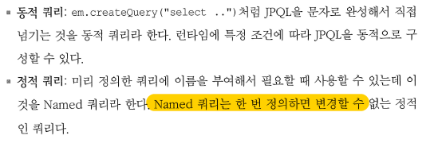

개인적으로 모르는 부분 적어두고 알게 되는 부분에 대해서 간단하게 정리해둔 자료입니다.
미 답변중에 알고 계신 부분 있으면 코멘트 달아주세요. 감사합니다.

## [Q&A 전체 목록](https://blog.advenoh.pe.kr/java/qa-%EA%B0%9C%EB%B0%9C%EA%B4%80%EB%A0%A8-%EC%A7%88%EB%AC%B8-%EB%AA%A8%EC%9D%8C/)

### [답변완료]

쉽게 찾기 위해서 알파벳 순으로 정리합니다.

### @EntityScan

이 어노테이션으로 엔티티 클래스를 스캔할 곳을 지정하는데 사용합니다. 메인 어플리케이션 패키지 내에 엔티티 클래스가 없는 경우 이 어노테이션을 사용해서 패키지 밖에 존재하는 엔티티를 지정할 수 있습니다. 기존적으로 @EnableAutoConfiguration 어노테이션에 의해서 지정한 곳에서 엔티티를 스캔합니다.

참고
* [https://dzone.com/articles/spring-boot-entity-scan](https://dzone.com/articles/spring-boot-entity-scan)

### @UniqueConstraint

이 어노테이션은 JPA 컬럼 2개 이상 unique하게 설정하려고 할때 사용합니다.

참고로 하나의 컬럼에 unique 한 설정을 하려면 아래와 같습니다.

참고
* [https://gs.saro.me/dev?page=4&tn=499](https://gs.saro.me/dev?page=4&amp;tn=499)
* [https://stackoverflow.com/questions/3126769/uniqueconstraint-annotation-in-java](https://stackoverflow.com/questions/3126769/uniqueconstraint-annotation-in-java)

### @CreatedDate, @LastModified

이 어노테이션은 처음 언티티 객체가 저장될 때 생성날짜, 수정날짜를 주입해줍니다.

참고
* [https://eclipse4j.tistory.com/201](https://eclipse4j.tistory.com/201)

### @BatchSize(size=30)

이 어노테이션은 JPA의 N+1을 해결할 수 있는 방법중에 하나로 연관된 엔티티를 조회할 때 지정된 size 만큼 SQL의 IN 절을 사용해서 사이즈만큰 한번에 가져와서 조회합니다.

참고

* [https://joont92.github.io/jpa/JPA-%EC%84%B1%EB%8A%A5-%EC%B5%9C%EC%A0%81%ED%99%94/](https://joont92.github.io/jpa/JPA-%EC%84%B1%EB%8A%A5-%EC%B5%9C%EC%A0%81%ED%99%94/)

- - - -

### [미 답변 질문]

#### - @NaturalId
하이버네티으에서 Named query 대신에 사용할 수 있는 네임 쿼리란 한번 정의하면 변경할 수 없는 정적 쿼리이다.

참고
* [https://howtodoinjava.com/hibernate/hibernate-naturalid-example-tutorial/](https://howtodoinjava.com/hibernate/hibernate-naturalid-example-tutorial/)

#### - @EntityListeners, @EnableJpaAuditing

참고
* [https://www.logicbig.com/tutorials/java-ee-tutorial/jpa/entity-listeners.html](https://www.logicbig.com/tutorials/java-ee-tutorial/jpa/entity-listeners.html)
* [https://www.logicbig.com/tutorials/java-ee-tutorial/jpa/entity-audit-listener.html](https://www.logicbig.com/tutorials/java-ee-tutorial/jpa/entity-audit-listener.html)

