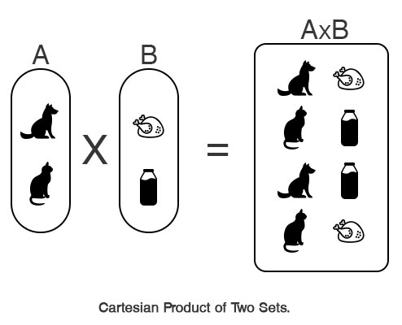
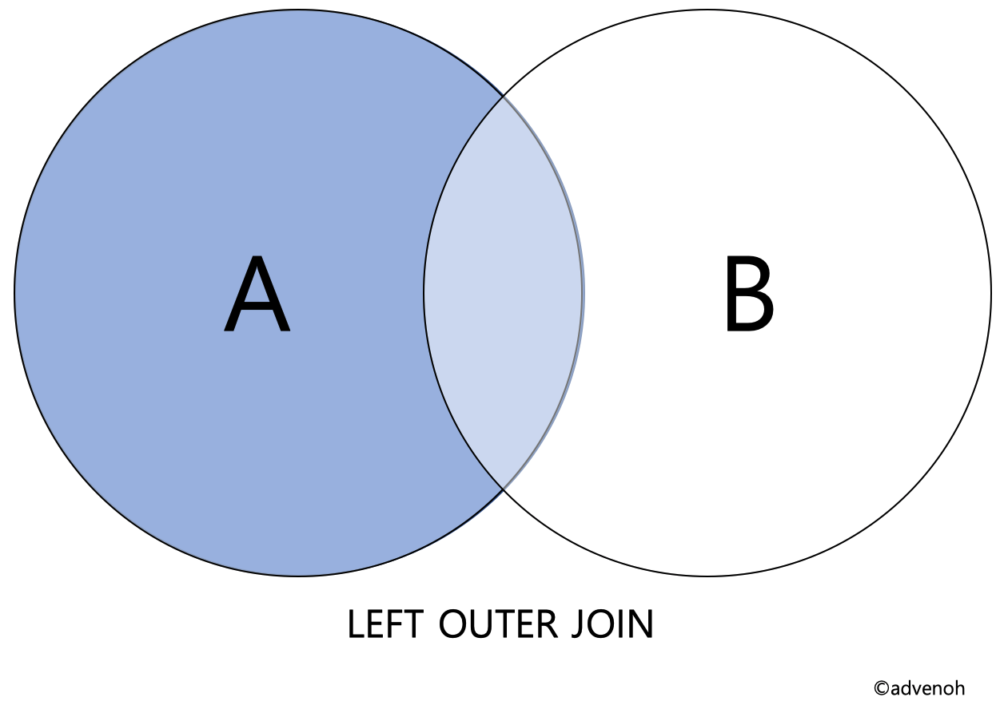
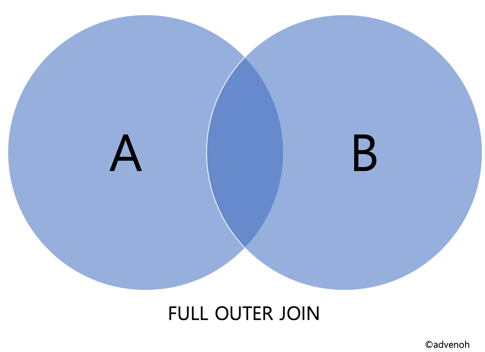
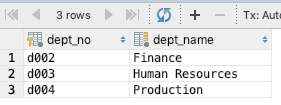

# 1.JOIN에 대한 기본 개념정리
관계형 데이터베이스에서는 중복 데이터를 피하기 위해서 데이터를 쪼개 여러 테이블로 나눠서 저장합니다. 이렇게 분리되어 저장된 데이터에서 원하는 결과를 다시 도출하기 위해서는 여러 테이블을 조합할 필요가 있습니다. 관계형 데이터베이스에서는 조인(JOIN) 연산자를 사용해 관련 있는 컬럼 기준으로 행을 합쳐주는 연산입니다. 조인에 대해서 공부하다 보면 종류도 많아서 처음에는 많이 헷갈릴 때가 종종 있어서 다시 정리를 해보았습니다.

# 2. 샘플 데이터

이 포스팅에서 사용한 데이터는 MySql 사이트에서 제공한 샘플 데이터를 참고해서 수정한 버전을 사용했습니다.

* MySql dummy 데이터
	* [https://github.com/datacharmer/test_db](https://github.com/datacharmer/test_db)
* 수정 버전 - 예제로 작성한 sql도 확인할 수 있다
	* [https://github.com/kenshin579/books-database-intro/tree/master/02_join](https://github.com/kenshin579/books-database-intro/tree/master/02_join)

주어진 샘플 데이터로 직접 SQL을 쳐보면서 여러 조인 타입을 스터디하면 더 좋을 것 같습니다.


# 3. 조인의 종류

MySQL에서 지원하는 조인 연산입니다. 그외 조인은 설명 위주로 말씀을 드리겠습니다.

* 내부 조진 (INNER JOIN)
	* 교차 조인 (CROSS JOIN - CARTESIN JOIN)
	* 등가_동등_동일 조인(EQUI JOIN)
	* 비등가 조인(NON-EQUI JOIN)
	* 자연 조인 (NATURAL JOIN)
* 외부 조인 (OUTER JOIN)
	* 완전 외부 조인 (FULL OUTER JOIN)
	* 왼쪽 (LEFT OUTER)
	* 오른쪽 (RIGHT OUTER)
* 셀프 조인 (SELF JOIN)
* 안티 조인 (ANTI JOIN)
* 세미 조인 (SEMI JOIN)

SQL 조인 쉽게 이해하기 위한 다이어그램입니다.


## 3.1 내부 조인

내부 조인을 더 세부적으로 분류하면 아래와 같습니다.

* 교차 조인 (CROSS JOIN - CARTESIN JOIN)
* 동등/동일 조인(EQUI JOIN)
* 비등가 조인(NON-EQUI JOIN)
* 자연 조인 (NATURAL JOIN)

### 3.1.1 교차 조인 (CROSS JOIN - CARTESIN PRODUCT)

교차 조인은 두 테이블의 카티션 프로덕트(곱집합)를 한 결과입니다. 특별한 조건없이 테이블 A의 각 행과 테이블 B의 각 행을 다 조합한 결과입니다.



조인 SQL 구문은 두가지 표현법으로 만들 수 있습니다. 구체적인 SQL 구문이 있는 명시적 표현법과 암묵적인 표현 방식이 있습니다.

```sql
-- 교차 조인 (CROSS JOIN)

# 명시적 표현법 (explicit notation)
SELECT *
FROM employees
CROSS JOIN dept_emp;

# 암묵적 표현법 (implicit notation)
SELECT *
FROM employees, dept_emp;
```

참고로 교차 조인은 암묵적인 표현법에서 WHERE 문구가 없습니다.

**조인 결과**


### 3.1.2 내부 조인 (INNER JOIN)

내부 조인은 가장 많이 사용되는 조인 구문중에 하나입니다. 내부 조인은 조인 조건문에 따라 2개의 테이블(A, B)의 컬럼을 합쳐 새로운 테이블을 생성합니다. 즉, 교차 조인을 한 결과에 조인 조건문을 충족시키는 레코드를 반환한다고 생각하시면 됩니다. 내부 조인을 벤 다이어그램으로 표현하면 아래와 같이 하이라이트된 부분이 조건문을 충족시키는 부분입니다.


SQL은 명시적 표현법과 암묵적 표현법 2가지 구문으로 지정할 수 있습니다.

```sql
-- 내부 조인 (INNER JOIN)

-- 명시적 표현법 (explicit notation)
SELECT *
FROM employees
INNER JOIN dept_emp
ON employees.emp_no = dept_emp.emp_no;

-- 암묵적 표현법 (implicit notation)
SELECT *
FROM employees, dept_emp
WHERE employees.emp_no = dept_emp.emp_no;
```

**조인 결과**


### 3.1.3 등가 조인 (EQUI JOIN)

등가 조인은 비교기반 조인의 특정 유형으로 동등비교(=)를 사용하는 조인입니다. 이미 위 3.1.2에서 설명한 조인을 등가 조인(=동일 조인)이라고 합니다.

### 3.1.2 비등가 조인 (NON-EQUI JOIN)

비등가 조인은 동등비교(=)를 사용하지 않는 조인으로 조건문이 크거나 작거나 같이 않은 비교등을 사용하면 비등가 조인이라고 합니다.

```sql
-- 비등가 조인 (NON-EQUI JOIN)

-- 암묵적 표현법 (implicit notation)
SELECT *
FROM employees, departments
WHERE employees.emp_no between 10003 and 10004;
```

**조인 결과**


### 3.1.5 자연 조인 (NATURAL JOIN)

자연 조인은 동등 조인의 한 유형으로 두 테이블의 컬럼명이 같은 기준으로 조인 조건문이 암시적으로 일어나는 내부 조인입니다.

* 같은 이름을 가진 컬럼은 한 번만 추출된다
	* 동등 조인에서는 emp_no가 두번 추출된 것을 확인할 수 있다 (#3.1.2: 그림1)

```sql
-- 자연 조인 (NATURAL JOIN)
-- 명시적 표현법 (explicit notation)
SELECT *
FROM employees NATURAL JOIN dept_emp;
```

**조인 결과**


## 3.2 외부 조인 (OUTER JOIN)

내부 조인의 경우에는 공통 컬럼명 기반으로 결과 집합을 생성합니다. 반면에 외부 조인은 조건문에 만족하지 않는 행도 표시해주는 조인입니다. 그래서, 조인을 했을 때 한쪽의 테이블에 데이터가 없어도 조인 결과에 포함시키는 조인입니다. 외부 조인은 아래와 같이 3가지 종류가 있고 각각에 대해서 예제를 통해서 알아보도록 하겠습니다.

* 외부 조인 (OUTER JOIN)
	* 왼쪽 (LEFT OUTER)
	* 오른쪽 (RIGHT OUTER)
	* 완전 외부 조인 (FULL OUTER JOIN)
		* MySql에서는 이걸 지원하지 않지만, SQL UNION 구문으로 사용하면 된다

### 3.2.1 왼쪽 외부 조인 (LEFT OUTER JOIN)

왼쪽 외부 조인은 테이블 A의 모든 데이터와 테이블 B와 매칭이 되는 레코드를 포함하는 조인입니다.



이해하기 쉽게 간단한 예제를 추가해봤습니다.

```sql
SELECT *
FROM table1
LEFT OUTER JOIN table2
ON table1.n = table2.n;
```

**조인 결과 =** table1의 모든 데이터 + table1과 table2 컬럼(n)과 매칭이 되는 데이터


```sql
-- 왼쪽 외부 조인 (LEFT OUTER JOIN)
-- 명시적 표현법 (explicit notation)
SELECT *
FROM employees
LEFT OUTER JOIN departments
ON employees.dept_no = departments.dept_no;
```

**조인 결과**


**내부 조인 결과**


### 3.2.2 오른쪽 외부 조인 (RIGHT OUTER JOIN)

왼쪽 외부 조인은 테이블 B의 모든 데이터와 테이블 A와 매칭이되는 레코드를 포함하는 조인입니다.


```sql
SELECT *
FROM table1
RIGHT OUTER JOIN table2
ON table1.n = table2.n;
```

**조인 결과 =** table2의 모든 데이터 + table1과 table2 컬럼(n)과 매칭이 되는 데이터


```sql
-- 오른쪽 외부 조인 (RIGHT OUTER JOIN)
-- 명시적 표현법 (explicit notation)
SELECT *
FROM employees
RIGHT OUTER JOIN departments
ON employees.dept_no = departments.dept_no;
```

**조인 결과**


### 3.2.3 완전 외부 조인 (FULL OUTER JOIN)

완전 외부 조인은 MySQL에서는 명시적인 SQL 구문은 지원하지 않지만, UNION을 사용해서 완전 외부 조인을 할 수 있습니다.



```sql
-- 방법1 : JOIN와 UINION
SELECT *
FROM table1
LEFT OUTER JOIN table2
ON table1.n = table2.n
UNION
SELECT *
FROM table1
RIGHT OUTER JOIN table2
ON table1.n = table2.n;

-- 방법2 : UNION ALL and exclusion join
SELECT *
FROM table1
LEFT OUTER JOIN table2
ON table1.n = table2.n
UNION ALL
SELECT *
FROM table1
RIGHT OUTER JOIN table2
ON table1.n = table2.n
WHERE table1.n IS null;
```

**조인 결과** - 왼쪽 외부 조인 + 오른쪽 외부 조인


테이블 employees와 departments의 완전 외부 조인문과 그 결과입니다.

```sql
SELECT *
FROM employees
LEFT OUTER JOIN departments
ON employees.dept_no = departments.dept_no
UNION
SELECT *
FROM employees
RIGHT OUTER JOIN departments
ON employees.dept_no = departments.dept_no;
```

**조인 결과**


## 3.3 셀프 조인 (SELF JOIN)

셀프 조인은 자기 자신과 조인하는 조인입니다. 예를 들면, 임직원중에 같은 부서에서 일하는 직원을 알고 싶으면 셀프 조인을 사용하면 좋습니다.

```sql
-- 셀프 조인(SELF JOIN)
-- 암묵적 표현법 (implicit notation)
SELECT A.first_name AS EmployeeName1, B.first_name AS EmployeeName2, A.dept_no
FROM employees AS A, employees AS B
WHERE A.emp_no <> B.emp_no
AND A.dept_no = B.dept_no;
```

**조인 결과**


## **3.4 안티 조인 (ANTI JOIN)**

안티 조인은 서브 쿼리내에서 존재하지 않는 데이터만 추출하여 메인 쿼리에서 추출하는 조인입니다. 간단한 예제로 부서 번호(dept_no)가 2 이상이 아닌 데이터와 임직원 번호(emp_no)가 10002이상인 임직원을 추출하기로 보겠습니다. NOT EXISTS나 NOT IN을 사용해서 작성할 수 있습니다.

```sql
-- 안티 조인 (ANTI JOIN)

SELECT *
FROM employees AS e
WHERE emp_no >= 10002
AND NOT EXISTS(SELECT *
FROM departments AS d
WHERE e.dept_no = d.dept_no
AND d.dept_no >= 2);
```

**조인 결과**


 

## **3.5 세미 조인 (SEMI JOIN)**

세미 조인은 안티 조인과 반대로 서브 쿼리 내에서 존재하는 데이터만을 가지고 메인 쿼리에서 추출하는 방식입니다.

```sql
-- 세미 조인 (SEMI JOIN)
-- EXISTS 사용
SELECT *
FROM departments as d
WHERE EXISTS(SELECT *
FROM employees AS e
WHERE e.dept_no = d.dept_no
AND e.emp_no >= 10003);

-- IN 사용
SELECT *
FROM departments as d
WHERE d.dept_no IN (SELECT e.dept_no
FROM employees AS e
WHERE e.emp_no >= 10003);
```

**조인 결과**



# 4. 참고

* 조인 종류
	* [https://wikidocs.net/3956](https://wikidocs.net/3956)
	* [https://coding-factory.tistory.com/87](https://coding-factory.tistory.com/87)
	* [https://blog.ngelmaum.org/entry/lab-note-sql-join-method](https://blog.ngelmaum.org/entry/lab-note-sql-join-method)
	* [http://postitforhooney.tistory.com/entry/DBMARIADB-SQL-예제를-통한-JOIN의-종류-파악](http://postitforhooney.tistory.com/entry/DBMARIADB-SQL-%EC%98%88%EC%A0%9C%EB%A5%BC-%ED%86%B5%ED%95%9C-JOIN%EC%9D%98-%EC%A2%85%EB%A5%98-%ED%8C%8C%EC%95%85)
	* [http://futurists.tistory.com/17](http://futurists.tistory.com/17)
	* [https://ko.wikipedia.org/wiki/Join_(SQL](https://ko.wikipedia.org/wiki/Join_%28SQL) )
	* [https://coloringpagewiki.com/img/2802678/mysql-whats-the-difference-between-inner-join-left-join-right-also-check-this-post-sql-server-better-performance-left-join-or-not-in.asp](https://coloringpagewiki.com/img/2802678/mysql-whats-the-difference-between-inner-join-left-join-right-also-check-this-post-sql-server-better-performance-left-join-or-not-in.asp)
* FULL JOIN
	* [https://www.xaprb.com/blog/2006/05/26/how-to-write-full-outer-join-in-mysql/](https://www.xaprb.com/blog/2006/05/26/how-to-write-full-outer-join-in-mysql/)
* ANIT JOIN

	* [https://thebook.io/006696/part01/ch06/02/03/](https://thebook.io/006696/part01/ch06/02/03/)
* SEMI JOIN
	* [http://wiki.gurubee.net/pages/viewpage.action?pageId=1966761](http://wiki.gurubee.net/pages/viewpage.action?pageId=1966761)
* 조인 사용시 주의사항
	* [http://gywn.net/2012/05/mysql-bad-sql-type/](http://gywn.net/2012/05/mysql-bad-sql-type/)
* 곱집합

	* [https://www.codewars.com/kata/cartesian-product](https://www.codewars.com/kata/cartesian-product)
