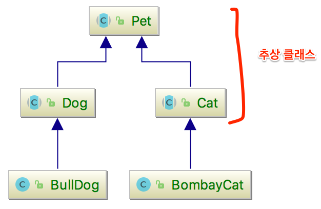
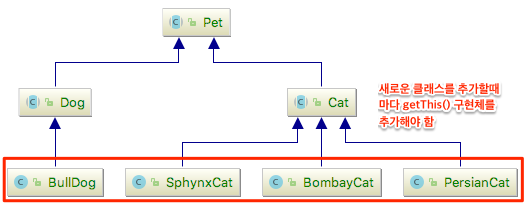

# 1. 메서드 체이닝이란

메서드 체이닝이란 여러 메서드 호출을 연결해 하나의 실행문으로 표현하는 문법 형태를 말합니다. (위키피디아 참고 #4.1)

```java
//일반 메서드 호출
@Test
public void tesWithoutMethodChaining() {
    Pet pet = new Pet();
    pet.setName("BobbyPet");
    pet.setEyeColor("red");
    pet.setHungryLevel(10);
    LOG.info("{}", pet);
}

//메서드 체이닝 호출
@Test
public void testMethodChaining() {
    Pet pet = new Pet();
    pet.setName("BobbyPet")
            .setEyeColor("red")
            .setHungryLevel(10);
    LOG.info("{}", pet);
}
```


메서드 체이닝의 매직은 간단합니다. 체이닝으로 연결하고 싶은 메서드의 반환 값으로 this를 반환하면 됩니다.

```java
package simple.methodChain;

public class Pet {
    private String name;
    private String eyeColor;
    private int hungryLevel;

    public Pet setName(String name) {
        this.name = name;
        return this;
    }

    public Pet setEyeColor(String eyeColor) {
        this.eyeColor = eyeColor;
        return this;
    }
….
}
```

# 2. 추상 클래스와 상속 관계 있는 클래스에서의 메서드 체이닝 적용하기

## 2.1 One Depth : 추상 클래스 <--> 자식 클래스

한 클래스에서 메서드 체이닝을 적용하기는 쉽습니다. 하지만, 상속 관계가 있는 클래스에서는 this의 반환 값이 부모 클래스이거나 자식 클래스이기 때문에 메서드 체이닝을 할 때 캐스팅(cast)을 해줘야 하는 번거로움이 생깁니다.


```java
@Test
    public void testMethodChain() {
        Cat c1 = new Cat();
        c1.setAwesomeLevel(10) //child
                .setCutenessLevel(20) //child
                .setName("BobbyCat"); //parent
//                .setCutenessLevel(20); //child <— 위 부모 메서드 호출이후 자식 메서드를 호출할수 없음 (반환값이 Pet이기 때문에)

        LOG.info("c1 {}", c1);

        Cat c2 = new Cat();
        ((Cat)(c2.setAwesomeLevel(10) //child
                .setCutenessLevel(20) //child
                .setName("BobbyCat"))) //parent
                .setCutenessLevel(5); //child  <— 자식 객체로 캐스팅하면 다시 자식 메서드를 호출할 수 있지만, 가독성이 많이 떨어진다. 

        LOG.info("c2 {}", c2);
    }
```

이상적인 방법은 아래와 같은 형식으로 메서드 체이닝이 되면 좋죠. 메서드를 호출할 때마다 자식 객체(부모 메서드를 다 포함하고 있음)가 반환되면 캐스팅을 할 필요가 없어지니까요.

```java
Cat c1 = new Cat();
c1.setName("BobbyCat") //parent
        .setCutenessLevel(20) //child
        .setEyeColor("black") //parent
        .setAwesomeLevel(10); //child
```

위 아이디어를 실행하기 위해 제네릭과 getThis() 함수를 추가하여 해결해보죠. 부모 클래스에 getThis()를 추상화 함수로 정의하고 체이닝 함수를 원하는 메서드마다 호출하여 제네릭 타입 T를 반환하도록 합니다. 그리고 자식 클래스에서는 실제 getThis()를 구현하여 자기 자신을 반환하도록 하면 우리가 원하는 의도대로 동작할 것입니다. 실제 코드를 보고 확인해보죠. 참고로, T extends Pet의 의미는 Pet 유형(하위 클래스 포함)이면 T자리에 들어갈 수 있다는 의미입니다. 

```java
public abstract class Pet<T extends Pet<T>> {
    private String name;

    private String eyeColor;
    private int hungryLevel;

    protected abstract T getThis();

    public T setName(String name) {
        this.name = name;
        return getThis();
    }
…
}

public class Cat extends Pet<Cat> {
    private int awesomeLevel;
    private int cutenessLevel;

    @Override
    protected Cat getThis() {
        return this;
    }

    public Cat catchMice() {
        System.out.println("I caught a mouse!");
        return getThis();
    }
…
}
```

## 2.2 Two Depth : 추상 클래스 <—> 추상 클래스 <—> 자식 클래스

추상 클래스의 깊이(depth)가 2이상인 경우에도 1 depth인 클래스에 정의된 제네릭 부분과 크게 다르지 않습니다. Pet과 BombayCat 클래스는 1 depth인 경우와 유사하고 Cat 클래스의 경우에는 Cat 타입에 허용될 수 있는 제네릭을 정의하면 됩니다. 



```java
public abstract class Cat<T extends Cat<T>> extends Pet<T> {
    private int awesomeLevel;
    private int cutenessLevel;

    public T setAwesomeLevel(final int awesomeLevel) {
        this.awesomeLevel = awesomeLevel;
        return getThis();
    }
…
}
```

## 2.3 Two Depth : 추상 클래스 <—> 추상 클래스 <—> 자식 클래스 refactoring

새로운 Cat 클래스를 추가할때마다 getThis()의 구현체를 매번 추가해야 하는 번거로움이 생깁니다. getThis() 구현은 this를 반환하는 것밖에 없으니까, 인터페이스 함수로 빼서 default로 정의하고 구현체를 담아보면 코드가 더 깔끔해집니다. 



```java
package complex.twoDepthAbstract.solution;

public interface IPet<T> {

    @SuppressWarnings("unchecked")
    default T getThis() {
        return (T) this;
    }
}
```

# 3. 소스 예제

전체 소스 코드는 [github](https://github.com/kenshin579/tutorials-java-examples/tree/master/java-method-chain) 에서 찾을 수 있습니다.

# 4. 참고

- [https://en.wikipedia.org/wiki/Method_chaining](https://en.wikipedia.org/wiki/Method_chaining)
- [https://stackoverflow.com/questions/1069528/method-chaining-inheritance-don-t-play-well-together](https://stackoverflow.com/questions/1069528/method-chaining-inheritance-don-t-play-well-together)
- [https://www.andygibson.net/blog/article/implementing-chained-methods-in-subclasses/](https://www.andygibson.net/blog/article/implementing-chained-methods-in-subclasses/)
- [https://stackoverflow.com/questions/15054237/oop-in-java-class-inheritance-with-method-chaining](https://stackoverflow.com/questions/15054237/oop-in-java-class-inheritance-with-method-chaining)
- [http://www.angelikalanger.com/GenericsFAQ/FAQSections/ProgrammingIdioms.html#FAQ206](http://www.angelikalanger.com/GenericsFAQ/FAQSections/ProgrammingIdioms.html#FAQ206)
- [https://www.baeldung.com/java-type-casting](https://www.baeldung.com/java-type-casting)
