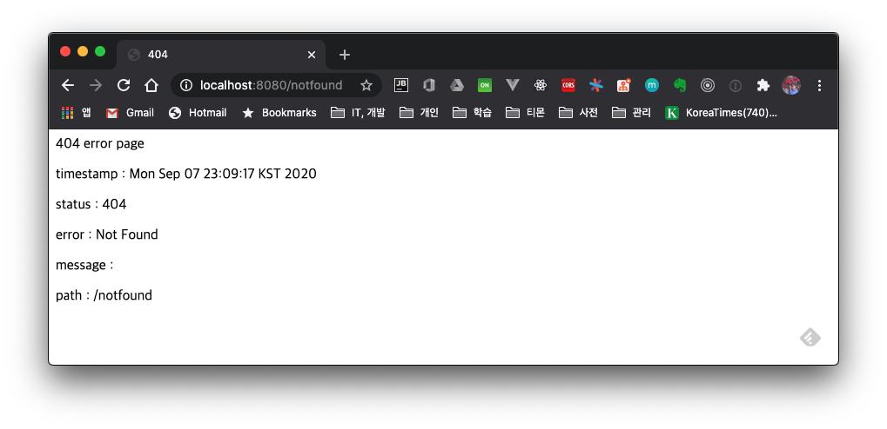

# 1. 들어가며

존재하지 않는 API를 접속하게 되면 아래와 같은 Whitelabel Error Page를 자주 접하게 됩니다. 별도 설정을 하지 않았다면 스프링부트에서는 기본적으로 Whitelabel Error Page를 보여줍니다. 


오류 처리 관련해서 어떤 처리가 기본적으로 되어 있는지 어떻게 변경을 할 수 있는지 알아보죠. 

## 1.1 BasicErrorController - 기본 오류처리 컨트롤러

스프링부트에서 BasicErrorController가 이런 기본적인 오류처리를 담당합니다. `application.properties`에서 `server.error.path`를 설정하지 않았다면 `/error`가 기본 오류처리 PATH 주소로 지정됩니다. 

```java
@Controller
@RequestMapping("${server.error.path:${error.path:/error}}")
public class BasicErrorController extends AbstractErrorController {
...
```

### 1.1.1 Whitelabel error page

브라우져에서 접속하면 Whitelabel Error Page 보여줍니다.


```html
GET http://localhost:8080/notfound
Accept: text/html

...생략...

<html>
<body><h1>Whitelabel Error Page</h1>
<p>This application has no explicit mapping for /error, so you are seeing this as a fallback.</p>
<div id='created'>Sat Sep 05 16:54:38 KST 2020</div>
<div>There was an unexpected error (type=Not Found, status=404).</div>
<div></div>
</body>
</html>

Response code: 404; Time: 212ms; Content length: 286 bytes

```

Request 해더에 Accept 속성 값이 `text/html`인 경우에는 아래 코드가 실행되면서 오류 페이지를 뷰로 반환해주고 있습니다.

```java
@RequestMapping(produces = MediaType.TEXT_HTML_VALUE)
public ModelAndView errorHtml(HttpServletRequest request, HttpServletResponse response) {
		HttpStatus status = getStatus(request);
		Map<String, Object> model = Collections
				.unmodifiableMap(getErrorAttributes(request, getErrorAttributeOptions(request, MediaType.TEXT_HTML)));
		response.setStatus(status.value());
		ModelAndView modelAndView = resolveErrorView(request, response, status, model);
		return (modelAndView != null) ? modelAndView : new ModelAndView("error", model);
}
```

### 1.1.2 Json 응답

Accept 값이 `application/json`인 경우에는 응답 값을 JSON 형태로도 내려줍니다.

```json
GET http://localhost:8080/notfound
Accept: application/json

...생략...

{
  "timestamp": "2020-09-05T07:58:28.016+00:00",
  "status": 404,
  "error": "Not Found",
  "message": "",
  "path": "/notfound"
}

Response code: 404; Time: 221ms; Content length: 110 bytes

```

Json 응답 값은 `error(HttpServletRequest request)` 메서드에서 처리하여 응답 값을 내려줍니다.

```java
@RequestMapping
public ResponseEntity<Map<String, Object>> error(HttpServletRequest request) {
		HttpStatus status = getStatus(request);
		if (status == HttpStatus.NO_CONTENT) {
			return new ResponseEntity<>(status);
		}
		Map<String, Object> body = getErrorAttributes(request, getErrorAttributeOptions(request, MediaType.ALL));
		return new ResponseEntity<>(body, status);
}
```

> 응답 값은 `getErrorAttributes()` 메서드에서 채워주고 있습니다. 

```java
public class DefaultErrorAttributes implements ErrorAttributes, HandlerExceptionResolver, Ordered {

  ...생략...
  public Map<String, Object> getErrorAttributes(WebRequest webRequest, boolean includeStackTrace) {
      Map<String, Object> errorAttributes = new LinkedHashMap();
      errorAttributes.put("timestamp", new Date());
      this.addStatus(errorAttributes, webRequest);
      this.addErrorDetails(errorAttributes, webRequest, includeStackTrace);
      this.addPath(errorAttributes, webRequest);
      return errorAttributes;
  }
}
```

# 2. Custom Error 페이지에 대한 처리

## 2.1 Error 관련 Properties

서버 오류 관련 설정은 아래와 같습니다. 

| 키 값               | 기본 값  | 설명     |
| -------------------------- | -------- | -------- |
| `server.error.include-binding-errors` | `never`  | 바인딩 오류를 포함시킬 때|
| `server.error.include-exception`      | `false`  | 예외 내용을 포함시킬 때 |
| `server.error.include-message`        | `never`  | 오류 메시지를 포함시킬 때 |
| `server.error.include-stacktrace`     | `never`  | stacktrace를 포함시킬 떄 |
| `server.error.path`                   | `/error` | 오류 처리할 컨트롤러 패스   |
| `server.error.whitelabel.enabled`     | `true`   | 브라우져에서 오류 페이지를 보여줄 지 결정한다. <br />false로 지정하면 tomcat의 오류 페이지로 로딩이 된다 |


## 2.2 특정 응답코드에 대한 Custom Error 페이지 만들기

Custom Error 페이지 만들어서 사용하는 건 간단합니다. 아래 폴더중에 한 곳에 `error/{응답코드}.<확장명>` 형식으로 파일을 생성하면, 스프링 부트에서 Http 상태 값에 다라서 해당 파일을 로딩해줍니다. 

- 폴더
  - `/templates/error`
  - `/static/error`
- 파일
  - `4xx.<확장명>`
    - 400번 대의 모드 상태 코드 발생시 이 파일로 로딩이 된다
  - `404.<확장명>`
    - Http 상태 코드가 404인 경우에 이 파일이 로딩이 된다

본 포스팅에서는 Mustache를 View Template Engine으로 사용하였고 `templates/error` 폴더에 404와 5xx에 해당하는 파일을 생성했습니다.

```shell
% tree .
.
├── application.properties
├── static
└── templates
    ├── error
    │   ├── 404.mustache
    │   └── 5xx.mustache
    └── index.mustache
```

`404.mustache` 파일을 작성합니다. 

```html
<!DOCTYPE html>
<html lang="en">
<head>
    <meta charset="UTF-8">
    <title>404</title>
</head>
<body>
404 error page
<p>timestamp : {{timestamp}}</p>
<p>status : {{status}}</p>
<p>error : {{error}}</p>
<p>message : {{message}}</p>
<p>path : {{path}}</p>
</body>
</html>
```

브라우져에서 존재하지 않는 path로 접속을 하면 404 응답 오류가 발생하여 위 view 파일이 응답으로 처리됩니다. 



## 2.3 별도 ErrorController 를 생성하기

위와 같이 특정 응답 코드에 대해서 뷰 파일을 생성하는 방식은 특정 로직을 수행할 수 없는 단점이 있습니다. 이런 경우에 Custom Error Controller를 생성하여 `/error` PATH에 대한 호출은 이 컨트롤러에서 처리하도록 할 수 있습니다. 

```java
@Slf4j
@Controller
public class CustomErrorController implements ErrorController {

    @GetMapping("/error")
    public String handleError(HttpServletRequest request) {
        Object status = request.getAttribute(RequestDispatcher.ERROR_STATUS_CODE);
        if (status != null) {
            int statusCode = Integer.valueOf(status.toString());
            if (statusCode == HttpStatus.NOT_FOUND.value()) {
                return "errors/404-custom";
            }
        }
        return "error";
    }

    /**
    * 이 메서드는 스프링 부트 2.3.x부터 deprecated 됨
    * - 이 메서드 대신 custom path를 지정하려면 server.error.path 속성으로 지정해야 한다
    */
    @Override
    public String getErrorPath() {
        return null;
    }
}

```

`handleError()`에서는 `errors/404-custom` 뷰를 반환합니다. 404 오류가 발생하면, 별도 뷰를 보여줍니다. 

# 4. 마치며

Whitelabel Error Page가 어떻게 로딩이 되는지 스프링부트의 내부 코드를 간단하게 살펴보았고 어떻게 오류 처리를 다르게 변경할 수 있는지도 알아보았습니다. 

전체 소스 코드는 [github](https://github.com/kenshin579/tutorials-java/tree/master/springboot-whitelabel-error-page)를 참고해주세요. 

# 5. 참고

* 스프링 부트 오류 처리
  * https://www.baeldung.com/spring-boot-custom-error-page
  * https://velog.io/@godori/spring-boot-error
  * https://goddaehee.tistory.com/214
  * https://supawer0728.github.io/2019/04/04/spring-error-handling/
* 스프링 부트 속성 목록
  * https://docs.spring.io/spring-boot/docs/current/reference/html/appendix-application-properties.html
